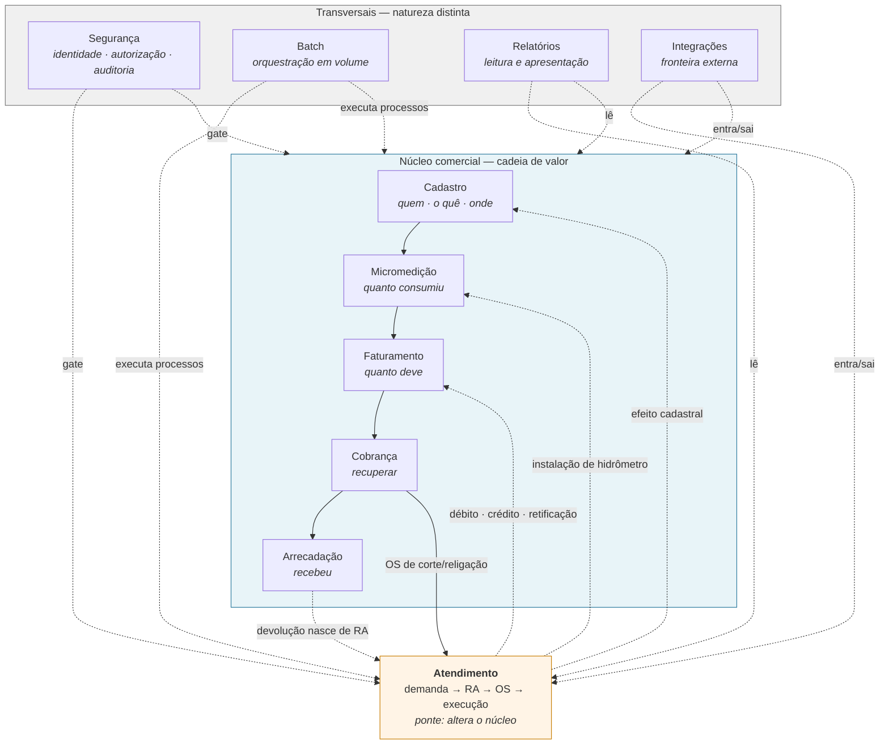
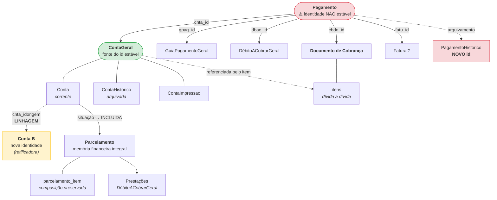
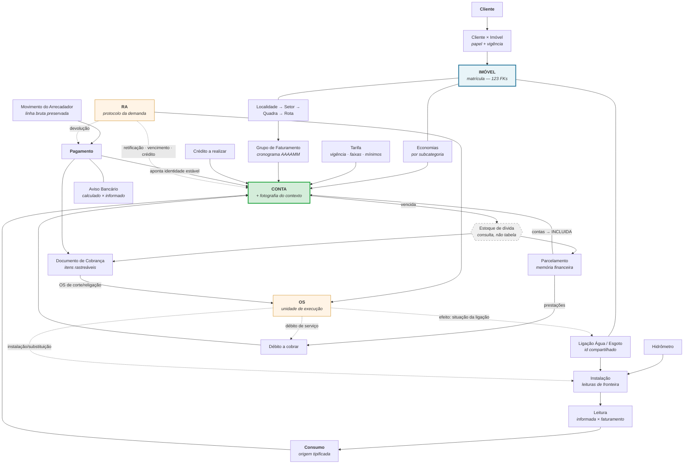
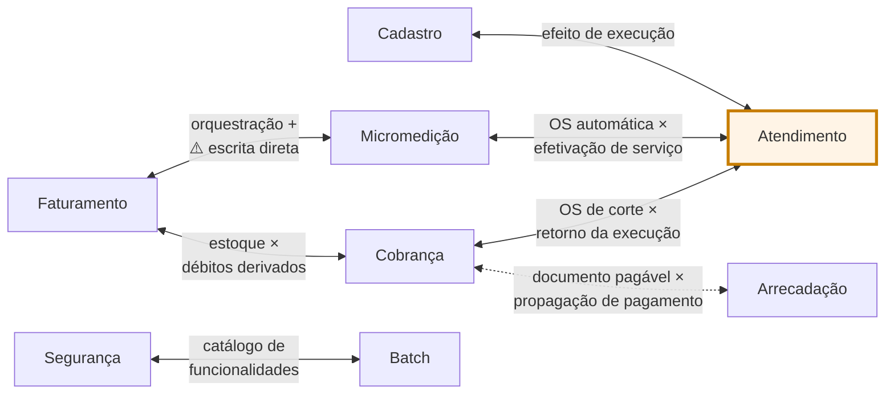

# Mapa de Domínio GSAN — Visão Integrada

> **Procedência**: consolidação dos dez mapas funcionais e do [glossário](glossario.md), sem reanálise de código. Base: `HEAD = 2031c4ca` (mapas) + `d38003e` (integrações e correções). Convenção de certeza e método em [`procedencia.md`](../procedencia.md): 🟢 fato · 🔵 interpretação sustentada · 🟡 hipótese · ❔ não compreendido.
>
> **Este documento não projeta o OpenGSAN.** Não há tabelas, entidades JPA, schemas, APIs nem classificação `PRESERVAR/MODERNIZAR/REESTRUTURAR/NÃO TRANSPORTAR` — isso é a próxima atividade. Aqui consolida-se **como o domínio do GSAN funciona e se relaciona**.

---

## 1. Objetivo

Transformar dez análises separadas em **um domínio coerente**: quais são os conceitos centrais, quem é dono de cada um, como se relacionam, que identidades precisam sobreviver, onde há histórico, onde há fotografia, o que é regra parametrizada, onde há variação por companhia e quais relações apresentam maior risco de serem quebradas por uma modernização.

---

## 2. Visão geral do domínio

🔵 O GSAN é, no fundo, **um sistema que responde a uma pergunta por mês, por imóvel**: *quanto este imóvel deve, por quê, e o que aconteceu com essa dívida?* Tudo mais existe para sustentar essa pergunta ou para lidar com suas consequências.

Três eixos organizam o sistema inteiro:

```text
EIXO 1 — O NÚCLEO COMERCIAL (cadeia de valor)
   Cadastro → Micromedição → Faturamento → Cobrança → Arrecadação
   "quem/o quê/onde"  →  "quanto consumiu"  →  "quanto deve"  →  "como recuperar"  →  "recebeu"

EIXO 2 — O DOMÍNIO OPERACIONAL (ponte entre demanda e mudança)
   Atendimento: demanda → RA → OS → execução → EFEITO nos domínios do Eixo 1

EIXO 3 — OS TRANSVERSAIS (não são domínios de negócio equivalentes)
   Segurança (quem pode) · Batch (quando/como em volume) · Relatórios (ler e apresentar) · Integrações (fronteira externa)
```

🔵 Quatro padrões estruturais atravessam **todos** os módulos e são a verdadeira "gramática" do GSAN:

| Padrão | O que é | Onde aparece |
| ------ | ------- | ------------ |
| **Regra como dado** | Comportamento definido por linha de tabela paramétrica, não por `if` | Situações de ligação, anormalidades, tarifas, ações de cobrança, especificações de solicitação, processos batch (§14) |
| **Identidade estável + versão + linhagem** | O documento tem id que sobrevive ao arquivamento; correções criam **novo** documento encadeado ao anterior | Conta/ContaGeral, RA reativado, OS de referência (§5) |
| **Fotografia na operação** | O documento congela o contexto de cálculo, porque o estado atual muda depois | Conta, Parcelamento, `conta_categoria`, `cliente_conta` (§6) |
| **Informado × efetivo** | Sempre há o par "o que veio" × "o que vale" | Leitura, anormalidade, prazo original × atual, prioridade original × atual, valor de serviço original × atual |

🔵 Quem modernizar o GSAN sem preservar esses quatro padrões terá reescrito outro sistema.

### Diagrama A — macro dos domínios



---

## 3. Grandes áreas funcionais — e o que cada uma realmente é

⚠️ As dez áreas herdadas do GSAN **não são dez bounded contexts equivalentes**. Classificá-las assim seria o primeiro erro de desenho do OpenGSAN. A natureza de cada uma:

| Área | Natureza | Justificativa (dos mapas) |
| ---- | -------- | ------------------------- |
| **Cadastro** | 🔵 **Domínio próprio, fundacional** | 123 FKs apontam para `cadastro.imovel`; fornece identidade, classificação e estado a todos |
| **Micromedição** | 🔵 **Domínio próprio** | Ciclo, regras e entidades próprias (equipamento, instalação, leitura, consumo); dona do dado de medição |
| **Faturamento** | 🔵 **Domínio próprio, núcleo financeiro** | Transforma estado + consumo em documento financeiro; dono de conta/débito/crédito/guia |
| **Cobrança** | 🔵 **Domínio próprio** | Ciclo de vida da obrigação **após** o faturamento; não cria a dívida original, cria a derivada |
| **Arrecadação** | 🔵 **Domínio próprio** | Reconhece, classifica e concilia o recebimento; tem competência e fechamento próprios |
| **Atendimento** | 🔵 **Domínio próprio + papel de ponte** | Tem entidades e ciclo próprios (RA, OS), **e** é o canal por onde mudanças entram nos outros domínios (§13) |
| **Segurança** | 🔵 **Transversal + domínio próprio pequeno** | Usuário/grupo/funcionalidade são entidades reais; mas a função é atravessar tudo |
| **Batch** | 🔵 **Infraestrutura de orquestração** | 🟢 "Não identifiquei regra de negócio de domínio dentro do `ControladorBatchSEJB`" — ele controla estado, não calcula |
| **Relatórios** | 🔵 **Infraestrutura de leitura/apresentação** | Motor comum; a consulta/regra pertence ao módulo dono |
| **Integrações** | 🔵 **Fronteira — e no GSAN nem sequer existe como camada** | 🟢 Sete padrões técnicos independentes, sem política comum ([integracoes.md §1](../modulos/integracoes.md)) |

🔵 **Consequência preliminar (não é decisão)**: Batch, Relatórios e Integrações comportam-se como **plataforma**, não como domínio. A implicação para o desenho modular — se viram módulos de aplicação ou capacidades de infraestrutura — é matéria da visão conceitual alvo, não desta consolidação.

🟢 **Observação de fronteira herdada do código**: as **ligações de água e esgoto** são conceitualmente do Cadastro, mas o código que as efetiva vive em `gcom.atendimentopublico`. A fronteira real é **"processo de atendimento → efeito cadastral"**, e isso vale como padrão, não como exceção (§13).

---

## 4. Entidades e conceitos centrais

Classificação conceitual conforme o roteiro. ⚠️ Onde não ficou claro, está marcado — não forcei.

### 4.1 Cadastro

| Conceito | Tipo | Nota |
| -------- | ---- | ---- |
| **Imóvel (matrícula)** | ENTIDADE · IDENTIDADE ESTÁVEL | Centro do modelo; id estável + DV módulo 11; exclusão lógica. 🔵 Sobrecarregado (§17) |
| **Cliente** | ENTIDADE · IDENTIDADE ESTÁVEL | PF/PJ com CPF/CNPJ; referenciado por pagamento, guia, negativação, RA |
| **Cliente × Imóvel** | ENTIDADE (associativa com vigência) | 🟢 Papel (proprietário/usuário/responsável) + início/fim + motivo. **Não** é FK simples |
| **Economia** | ⚠️ **CONCEITO SEM ENTIDADE** | 🟢 Não existe classe `Economia`. Materializa-se em `ImovelSubcategoria` (agregada — **governa a tarifa**), `imov_qteconomia` (denormalização) e `ImovelEconomia` (informativa). Ver §18 |
| **Categoria / Subcategoria** | PARAMETRIZAÇÃO (+ entidade) | 🟢 Não é rótulo: carrega limiares de análise de consumo usados pela Micromedição |
| **Ligação de Água / Esgoto** | ENTIDADE com **identidade compartilhada** | 🟢 `lagu_id = imov_id` por construção; o **estado corrente mora no Imóvel** (`last_id`/`lest_id`), não na ligação |
| **Situação de ligação** | PARAMETRIZAÇÃO | 🟢 A linha da tabela define faturar/não, consumo mínimo, dias para corte, "só consumo real" |
| **Localidade / Setor / Quadra** | ENTIDADE (hierarquia territorial) | Encadeamento estrito; base da abrangência de segurança |
| **Rota** | ENTIDADE (com três finalidades distintas) | 🟢 Leitura (via quadra), entrega (`rota_identrega`), alternativa (override, `rota_idalternativa`) |
| **Endereço** | ENTIDADE / VALOR | Base própria (logradouro/bairro/CEP); usada por imóvel, cliente e RA |

### 4.2 Micromedição

| Conceito | Tipo | Nota |
| -------- | ---- | ---- |
| **Hidrômetro** | ENTIDADE · IDENTIDADE ESTÁVEL | Equipamento com ciclo próprio, independente do imóvel |
| **Instalação de hidrômetro** | HISTÓRICO (o elo) | 🟢 `hidrometro_inst_hist`: vigente = `dataRetirada` nula; guarda **leituras de fronteira** (instalação/retirada) |
| **Leitura** | HISTÓRICO por imóvel+referência | 🟢 Par sistemático **informada × de faturamento** (leitura, data, anormalidade) |
| **Anormalidade de leitura** | PARAMETRIZAÇÃO | 🟢 Define consumo a cobrar e leitura a faturar, com/sem leitura; pode emitir OS |
| **Consumo** | HISTÓRICO + **origem tipificada** | 🟢 Três valores distintos no mês: faturado, para média, medido. `ConsumoTipo` = a origem |
| **Anormalidade de consumo** | PARAMETRIZAÇÃO escalonada | 🟢 Fator de consumo e carta por **mês de reincidência** (1º/2º/3º) |
| **Média** | VALOR derivado (insumo multiuso) | Faturar sem leitura · criticar consumo · gerar faixa esperada (antifraude) |

### 4.3 Faturamento

| Conceito | Tipo | Nota |
| -------- | ---- | ---- |
| **Referência (AAAAMM)** | VALOR — **eixo temporal do sistema inteiro** | 🟢 Indexa leitura, consumo, conta, contabilidade, pagamento e arrecadação |
| **Grupo de Faturamento** | ENTIDADE + PARAMETRIZAÇÃO do ciclo | 🟢 "Pulso" mensal: rotas do grupo são lidas, faturadas e vencem juntas |
| **Conta** | ENTIDADE · ARTEFATO · SNAPSHOT | O documento mensal; carrega a **fotografia completa** do contexto de cálculo |
| **ContaGeral** | **IDENTIDADE ESTÁVEL** (mecanismo) | 🟢 Entidade física fonte do id; 1:1 com corrente, histórica e impressão |
| **ContaHistórico** | HISTÓRICO / VERSÃO | 🟢 Arquivamento no encerramento mensal; **participa de consultas e regras**, não é depósito morto |
| **Tarifa / Vigência / Faixa** | PARAMETRIZAÇÃO versionada | 🟢 Vigência válida = maior data ≤ referência |
| **Débito (a cobrar / cobrado)** | ENTIDADE em dois momentos | Lançamento pendente × parcela efetivamente incluída em conta |
| **Crédito (a realizar / realizado)** | ENTIDADE em dois momentos | Espelho do débito |
| **Guia de Pagamento** | ENTIDADE · ARTEFATO | Cobrança avulsa fora do ciclo mensal; identidade estável própria |

### 4.4 Cobrança

| Conceito | Tipo | Nota |
| -------- | ---- | ---- |
| **Estoque de dívida** | ⚠️ **CONCEITO SEM ENTIDADE** | 🟢 "Não há cadastro de dívida" — o estoque **nasce por consulta**. Ver §18 |
| **Documento de Cobrança** | ENTIDADE · ARTEFATO | Instrumento de uma ação sobre um imóvel, com **itens rastreáveis dívida a dívida** |
| **Ação de Cobrança** | PARAMETRIZAÇÃO · PROCESSO | 🟢 Predecessora + critério + situações-alvo + tipo de OS que gera — **o workflow é dado** |
| **Parcelamento** | ENTIDADE · PROCESSO · SNAPSHOT financeiro | 🟢 Preserva a composição por item **e** a memória financeira integral |
| **Prestação** | Débito a cobrar tipificado | Entra nas contas futuras como qualquer débito |
| **Reparcelamento** | ENTIDADE encadeada | 🟢 Novo parcelamento englobando saldo do anterior; contadores + funções de cadeia no banco |
| **Negativação** | PROCESSO (do **cliente**) | 🟢 Atinge CPF/CNPJ sobre dívida do imóvel; movimentos de inclusão/exclusão |

### 4.5 Arrecadação

| Conceito | Tipo | Nota |
| -------- | ---- | ---- |
| **Pagamento** | ENTIDADE — ⚠️ **identidade NÃO estável** | 🟢 Ao arquivar, recebe **novo id** (`seq_pagamento_historico`). Assimetria única no sistema (§5) |
| **Situação do pagamento** | **Núcleo semântico do módulo** | 🟢 14 situações; nenhum pagamento é descartado — impossibilidade vira **estado**, com situação anterior preservada |
| **Movimento do Arrecadador** | ENTIDADE · ARTEFATO recebido | 🟢 Preserva **a linha bruta do arquivo** + totais de conferência |
| **Aviso Bancário** | ENTIDADE de conciliação | 🟢 **calculado × informado** é o mecanismo, com acertos e deduções |
| **Devolução** | ENTIDADE simétrica ao pagamento | Guia própria, situações próprias, duas competências |
| **Guia de Devolução** | ARTEFATO | Instrumento da saída de dinheiro |

### 4.6 Atendimento

| Conceito | Tipo | Nota |
| -------- | ---- | ---- |
| **Registro de Atendimento (RA)** | ENTIDADE · PROCESSO · IDENTIDADE ESTÁVEL | 🔵 **Protocolo da demanda** — compromisso com prazo, não execução |
| **Ordem de Serviço (OS)** | ENTIDADE · PROCESSO · IDENTIDADE ESTÁVEL | 🔵 **Unidade de execução**. 🟢 Encerrar ≠ executar (estado explícito "encerrada não executada") |
| **Especificação da solicitação** | **PARAMETRIZAÇÃO — o núcleo do módulo** | 🟢 ~20 flags definem prazo, obrigatoriedades, geração de OS, efeitos financeiros, encerramento automático, canal |
| **Tipo de Serviço** | PARAMETRIZAÇÃO (2º nível) | 🟢 O que a companhia executa; já traz `DebitoTipo`/`CreditoTipo` a lançar |
| **Tramitação (`Tramite`)** | HISTÓRICO auditável | 🟢 Origem, destino, responsável, **quem registrou**, parecer — `unid_idatual` é só o estado corrente |

### 4.7 Segurança

| Conceito | Tipo | Nota |
| -------- | ---- | ---- |
| **Usuário** | ENTIDADE · IDENTIDADE ESTÁVEL | 🟢 Cinco eixos distintos no mesmo registro (§17) |
| **Grupo** | ENTIDADE (perfil funcional) | 🟢 União de concessões; basta um grupo conceder |
| **Funcionalidade / Operação** | **PARAMETRIZAÇÃO ancorada em URL** | 🟢 Resolvidas por `CAMINHO_URL`; concessão é o trio grupo × funcionalidade × operação |
| **Permissão Especial** | Capacidade **nomeada** para exceções | 🟢 Verificada dentro da Action, por constante |
| **Abrangência** | Recorte territorial hierárquico | 🟢 Gerência regional → unidade de negócio → elo/polo → localidade. ⚠️ Aplicação **manual** em cada consulta |
| **Unidade Organizacional** | ⚠️ **Não é autorização** | 🔵 É posicionamento no fluxo de trabalho (caixa, roteamento). Distinto de abrangência |
| **Auditoria** | Dois níveis distintos | 🟢 Operação efetuada (quem fez) + alteração por linha/coluna (o que mudou) — **restrita ao que está anotado** |

### 4.8 Batch e Relatórios

| Conceito | Tipo | Nota |
| -------- | ---- | ---- |
| **Processo / ProcessoIniciado** | Definição × execução | 🟢 Separação completa em três níveis |
| **Etapa (`ProcessoFuncionalidade` / `FuncionalidadeIniciada`)** | Definição × execução | 🟢 **Ancorada no catálogo de funcionalidades da Segurança** — catálogo único entre tela e batch |
| **Unidade de Processamento / Unidade Iniciada** | Partição | 🟢 `codigoRealUnidadeProcessamento` = base da retomada |
| **Relatório (definição)** | PARAMETRIZAÇÃO / catálogo | `batch.relatorio` |
| **Tarefa de relatório** | PROCESSO (solicitação executável) | Serializada em bytes no caminho batch |
| **RelatorioGerado** | ARTEFATO persistido | Binário no banco + páginas; ligado a `FuncionalidadeIniciada` |

### 4.9 Integrações

⚠️ Conforme o roteiro, **as integrações não viram entidades de domínio**. O que é de domínio são as **fronteiras e contratos**:

| Fronteira | O que atravessa | Nota |
| --------- | --------------- | ---- |
| Coleta em campo | Leitura/movimento de rota (entrada) | 🟢 Alimenta consumo → faturamento |
| OS móvel | Programadas, encerramento, fotos | Capacidade funcional legítima |
| Executante terceirizado (UPA/SAM) | OS exportada e devolvida executada | 🟢 Por **banco compartilhado**; identidade atravessa como **string de login** |
| Arquivo bancário | Movimento do arrecadador (entrada) | Dono: Arrecadação |
| Birô de crédito (SPC) | Consulta/negativação (saída) | Dono: Cobrança |
| Notificação | E-mail, SMS (saída) | Dono: vários |

---

## 5. Identidades estáveis do domínio

🔵 **Esta é a seção mais importante para a modernização.** Quebrar uma destas identidades quebra rastreabilidade financeira ou de atendimento — muitas vezes em silêncio.

| Identidade | Objeto que a representa | Estável? | Histórico/versão? | Quem guarda referência | Crítica p/ migração |
| ---------- | ----------------------- | -------- | ----------------- | ---------------------- | ------------------- |
| **Imóvel (matrícula)** | `imov_id` + DV módulo 11 | 🟢 **Sim** — nunca reaproveitada; exclusão lógica | Endereços e perfis anteriores em tabelas auxiliares | 🟢 **123 FKs**; praticamente todo o sistema | 🔴 **Máxima** — é a chave pública, conhecida por usuários |
| **Cliente** | `clie_id` (CPF/CNPJ como chave de negócio) | 🟢 Sim | Relação com imóvel versionada em `ClienteImovel` | Conta (fotografia), pagamento, guia, negativação, RA | 🔴 Alta |
| **Hidrômetro** | `hidr_id` + nº de série | 🟢 Sim | Instalações sucessivas em `hidrometro_inst_hist` | Instalação → leitura | 🟡 Média (patrimônio) |
| **Conta** | `cnta_id`, **originado de `ContaGeral`** | 🟢 Estável **corrente↔histórico**. ⚠️ **Não** atravessa retificação | `ContaHistorico` (mesmo id) + linhagem por `cnta_idorigem` | Pagamento, cobrança, parcelamento, débito automático | 🔴 **Máxima** |
| **Guia de Pagamento** | `GuiaPagamentoGeral` | 🟢 Mesmo padrão da conta | Histórico próprio | Pagamento, itens de cobrança/parcelamento | 🔴 Alta |
| **Débito a Cobrar** | `DébitoACobrarGeral` | 🟢 Mesmo padrão | Histórico próprio | Pagamento, cobrança, parcelamento (prestações) | 🔴 Alta |
| **Parcelamento** | `parc_id` | 🟢 Sim | Situação (normal/desfeito/concluído/cancelado) + encadeamento no reparcelamento | Conta (INCLUIDA), débitos, créditos, guia de entrada | 🔴 Alta |
| **Pagamento** | `pgmt_id` de `seq_pagamento` | ⚠️ 🟢 **NÃO** — ao arquivar recebe **novo id** | `PagamentoHistorico` com sequence própria | Aviso bancário, movimento do arrecadador | 🔴 **Alta — e é a anomalia do sistema** |
| **RA** | `rgat_id` | 🟢 Sim | Reativação/duplicidade **encadeiam protocolos distintos** | OS, débito, crédito, guia, parcelamento | 🟡 Média-alta (protocolo é comunicado ao cliente) |
| **OS** | `orse_id` | 🟢 Sim | `orse_idreferencia` encadeia diagnóstico → definitiva | Débito de serviço, documento de cobrança | 🟡 Média-alta |
| **Usuário** | `usur_id` + login | 🟢 Sim | Histórico de senhas, afastamentos, bloqueios | Auditoria (operação efetuada), solicitante de batch, tramitação | 🟡 Média |
| **Processo Batch (execução)** | `proi_id` / `fuin_id` / `undi_id` | 🟢 Sim (dentro da execução) | Estado, tempos, parâmetros e erro persistidos | `RelatorioGerado` | 🟢 Baixa (operacional) |

### 5.1 O mecanismo de identidade financeira — e sua distinção crítica

🟢 Duas coisas diferentes, que o projeto já confundiu uma vez e corrigiu:

```text
IDENTIDADE ESTÁVEL                          LINHAGEM
(o mesmo documento muda de lugar)           (um documento substitui outro)

  ContaGeral  ─────── mesmo cnta_id ──────►   Conta A (RETIFICADA)
      ├── Conta (corrente)                        │ cnta_idorigem
      ├── ContaHistorico (arquivada)              ▼
      └── ContaImpressao                      Conta B (NOVA identidade)

→ arquivar NÃO quebra referência             → retificar NÃO preserva o id
→ pagamento continua apontando               → a continuidade vem do ENCADEAMENTO
```

🔵 O mesmo princípio de **linhagem** reaparece em três lugares independentes — RA reativado/duplicado, OS de referência, reparcelamento. 🔵 É um padrão de domínio, não uma peculiaridade do faturamento: **o GSAN nunca reescreve um documento; cria outro e liga ao anterior.**

### Diagrama C — identidades financeiras



---

## 6. Estado atual, histórico e snapshot

🔵 O GSAN usa **quatro mecanismos distintos** para lidar com tempo. Confundi-los no OpenGSAN é um risco real, porque parecem a mesma coisa e não são.

| Mecanismo | O que faz | Exemplos comprovados |
| --------- | --------- | -------------------- |
| **① Estado corrente** | Um campo que reflete "como está agora" | 🟢 Situação das ligações **no Imóvel** (`last_id`/`lest_id`); `unid_idatual` no RA/OS; situação de cobrança no imóvel; instalação vigente (`dataRetirada` nula) |
| **② Histórico como série** | Uma linha por período, por natureza | 🟢 Consumo e medição por **imóvel + referência AAAAMM**; instalações sucessivas de hidrômetro; `Tramite` por RA |
| **③ Versão/arquivamento** | O mesmo documento muda de representação, **mantendo o id** | 🟢 `conta` → `conta_historico` no encerramento mensal (idem guia, débito, crédito); ⚠️ `pagamento` → `pagamento_historico` **perdendo o id** |
| **④ Fotografia (snapshot)** | O documento **congela o contexto** porque o original vai mudar | 🟢 Conta: situações das ligações, `cnta_pcesgoto`/`pccoleta`, tarifa, clientes (`cliente_conta`), categorias/economias/mínimos (`conta_categoria`). 🟢 Parcelamento: situações do imóvel + memória financeira integral |

### 6.1 Por que a fotografia existe (e por que não pode ser "otimizada")

🟢 O motivo é explícito no código e comprovado: *"o percentual do imóvel pode mudar depois; a conta precisa reproduzir o cálculo original"*. 🔵 Uma conta de 2019 precisa ser recalculável em 2026 mesmo que o imóvel tenha mudado de categoria, de percentual de esgoto, de tarifa e de dono.

⚠️ **Risco de modernização**: a fotografia parece redundância de dados (os mesmos valores "duplicados" na conta e no cadastro). Um redesenho "normalizador" que a remova **destrói a auditabilidade financeira retroativa** — e o sintoma só aparece meses depois, numa contestação de conta antiga.

### 6.2 Onde o par "informado × efetivo" aparece

🟢 Não é exclusivo da micromedição; é padrão de domínio:

| Par | Módulo |
| --- | ------ |
| Leitura informada × de faturamento | Micromedição |
| Anormalidade informada × de faturamento | Micromedição |
| Consumo medido × faturado × para média (**três** valores) | Micromedição |
| Prazo previsto original × atual | Atendimento |
| Prioridade original × atual | Atendimento |
| Valor de serviço original × atual | Atendimento |
| Situação atual × anterior (pagamento, devolução, conta, débito) | Arrecadação/Faturamento |
| Aviso bancário calculado × informado | Arrecadação |

🔵 Leitura integrada: o GSAN **nunca sobrescreve o que foi observado com o que foi decidido**. Isso é auditoria embutida no modelo, e é o que torna a caracterização (Fase 2) possível.

---

## 7. Ownership dos conceitos

🔵 Esta tabela é o insumo direto para as fronteiras de módulo do OpenGSAN (ADR-0001).

| Conceito | **Dono** | Consumidores | Observação de fronteira |
| -------- | -------- | ------------ | ----------------------- |
| Imóvel / matrícula | **Cadastro** | Micromedição, Faturamento, Cobrança, Arrecadação, Atendimento, Relatórios | 🟢 123 FKs |
| Cliente; Cliente×Imóvel | **Cadastro** | Faturamento (fotografia), Cobrança (negativação), Arrecadação, Atendimento | — |
| Economias / Categoria | **Cadastro** | Faturamento (tarifa), Micromedição (limiares de crítica) | Categoria é parametrização usada por dois módulos |
| Estrutura territorial (localidade/setor/quadra/rota) | **Cadastro** | Todos; **Segurança** usa como abrangência | — |
| Situação das ligações | **Cadastro** (armazena) | Faturamento (faturabilidade), Cobrança (ações) | ⚠️ Escrita vem do **Atendimento** (§13) |
| Hidrômetro; Instalação | **Micromedição** | Cadastro (ponteiro), Atendimento (OS) | 🟢 Atendimento origina o evento; Micromedição é dona do dado |
| Leitura; Consumo; Média | **Micromedição** | Faturamento | ⚠️ **Uma exceção comprovada**: retificação de conta escreve direto (§9) |
| Conta; ContaGeral; histórico | **Faturamento** | Cobrança, Arrecadação, Relatórios, Atendimento | Referenciada pela **identidade estável** |
| Tarifa / vigência / faixas | **Faturamento** | Micromedição (consumo mínimo) | — |
| Débito / Crédito / Guia | **Faturamento** | Cobrança (cria os derivados), Arrecadação (alvo de pagamento), Atendimento (dispara) | 🔵 Faturamento é dono; **outros criam lançamentos através dele** |
| Estoque de dívida | **Cobrança** (⚠️ é consulta, não entidade) | Atendimento (religação), Arrecadação | §18 |
| Documento de cobrança; Ação; Parcelamento; Negativação | **Cobrança** | Atendimento (OS), Arrecadação (alvo), Faturamento (recebe débitos derivados) | — |
| Pagamento; Devolução; Aviso bancário; Movimento | **Arrecadação** | Cobrança (reduz estoque por consulta), Faturamento (situação da conta) | — |
| RA; OS; Tramitação | **Atendimento** | Cobrança (gera OS), Micromedição (fiscalização), Faturamento (origem de lançamentos) | — |
| Especificação; Tipo de Serviço | **Atendimento** | — | Parametrização central do módulo |
| Usuário; Grupo; Funcionalidade; Abrangência; Auditoria | **Segurança** | **Todos** | 🟢 Funcionalidade é compartilhada com o **Batch** |
| Processo/Etapa/Unidade (execução) | **Batch** | Todos os módulos com processamento em lote | 🔵 Batch não é dono de regra de negócio |
| Relatório; Tarefa; Artefato | **Relatórios** | Todos | Consulta/regra pertence ao módulo dono |
| Contratos de fronteira externa | **Integrações** (⚠️ camada inexistente hoje) | Micromedição, Atendimento, Arrecadação, Cobrança | 🟢 Hoje espalhado por sete padrões |

---

## 8. Relações principais

### Diagrama B — núcleo comercial com Atendimento transversal



---

## 9. Fronteiras entre módulos

| Fronteira | O que atravessa | Direção | Dono do dado | Efeito de retorno? |
| --------- | --------------- | ------- | ------------ | ------------------ |
| Cadastro → Micromedição | Imóvel, ligação + situação, rota/sequencial, categoria (limiares), condomínio | → | Cadastro | 🟢 **Sim** — Micromedição atualiza os ponteiros de instalação vigente (`hidi_id`) |
| Micromedição → Faturamento | Consumo faturado + origem + anormalidade; leituras e datas; consumo mínimo calculado; média | → | Micromedição | ⚠️ 🟢 **Sim, e impuro**: a **retificação de conta escreve direto** em `ConsumoHistorico` (§20-6) |
| Faturamento → Cobrança | Contas por identidade estável (situação, valor, vencimento, motivo de revisão); guias; débitos | → | Faturamento | 🟢 **Sim** — Cobrança devolve situação INCLUIDA e **novos débitos/créditos** (prestações, juros, estornos) |
| Faturamento/Cobrança → Arrecadação | Identidades pagáveis (ContaGeral, Guia, Débito, Documento de Cobrança, Fatura) | → | Faturamento / Cobrança | 🟢 **Sim, mas indireto**: o pagamento não altera campo no documento; **a dívida cai por consulta** |
| Cobrança → Atendimento | Documento de cobrança → OS do tipo definido na ação (`orse.cbdo_id`) | → | Cobrança | 🟢 **Sim** — encerramento da OS atualiza situação da ligação e da ação |
| Atendimento → Cadastro | Efetivação de ligação/religação; recadastramento | → | Cadastro | 🟢 Marca a OS com `iccomercialatualizado` |
| Atendimento → Micromedição | Instalação/substituição/retirada/remanejamento de hidrômetro; fiscalização de leitura | → | Micromedição | 🟢 Idem; e anormalidade de leitura **emite OS automaticamente** (volta) |
| Atendimento → Faturamento | Débito de serviço, crédito, guia, **retificação de conta**, alteração de vencimento | → | Faturamento | — |
| Atendimento ↔ Arrecadação | RA de pagamento em duplicidade → devolução / crédito | ↔ | Arrecadação | 🟢 Devolução frequentemente **nasce de um RA** |
| Segurança → todos | Identidade na sessão; concessão por funcionalidade/operação; abrangência; auditoria | → | Segurança | ⚠️ 🟢 Abrangência **depende de chamada explícita** em cada consulta |
| Batch → vários | Orquestração (quando, partição, estado, retomada) | → | Batch | 🟢 O **controlador de negócio** é quem abre/fecha a unidade — não o MDB |
| Batch ↔ Segurança | 🟢 Etapas do batch **são as funcionalidades** do modelo de segurança | ↔ | Segurança (catálogo) | Catálogo compartilhado |
| Relatórios → vários | Consultas de leitura; artefato persistido | → | Módulo dono da consulta | 🟡 Parte dos relatórios monta a própria consulta (não quantificado) |
| Integrações → vários | Leitura de campo, OS móvel, arquivos bancários, birô, notificação | ↔ | Módulo dono do efeito | 🟢 Hoje **não há camada**; cada entrada resolve autenticação e erro por conta própria |

---

## 10. Dependências circulares

🔵 Ciclos confirmados nos mapas. **Não são para resolver agora** — são para registrar, porque determinam o que pode ou não ser separado no monólito modular.

### 10.1 Cadastro ↔ Atendimento — 🟢 **ciclo confirmado, e o mais estrutural**

```text
Cadastro ──► Atendimento : a situação derivada do imóvel habilita tipos de solicitação
Atendimento ──► Cadastro : a execução do serviço ALTERA a situação das ligações
```
🔵 Este ciclo é **de negócio, não acidental**: as ligações nascem de processo de atendimento, e seu estado vive no cadastro. 🟢 Reforço: o código das ligações mora em `gcom.atendimentopublico`, não em `gcom.cadastro`.

### 10.2 Micromedição ↔ Atendimento — 🟢 **ciclo confirmado e explicitamente bidirecional**

```text
Atendimento ──► Micromedição : Actions "Efetuar instalação/substituição/retirada de hidrômetro"
Micromedição ──► Atendimento : anormalidade de leitura EMITE OS automaticamente (ltan_icemissaoordemservico)
```

### 10.3 Cobrança ↔ Atendimento — 🟢 **ciclo confirmado**

```text
Cobrança ──► Atendimento : ação gera OS de corte/supressão/fiscalização (orse.cbdo_id)
Atendimento ──► Cobrança : encerramento da OS atualiza situação da ligação e da ação;
                            religação verifica débito (religarImovelCortado);
                            parcelamento pode nascer de RA (parc.rgat_id)
```

### 10.4 Faturamento ↔ Micromedição — 🟢 **ciclo confirmado, com dois níveis distintos**

```text
Micromedição ──► Faturamento : consumo como insumo (regra geral, limpa)
Faturamento ──► Micromedição : (a) ORQUESTRAÇÃO legítima — atualizarConsumosCondominios
                               (b) ⚠️ ESCRITA DIRETA — retificação altera ConsumoHistorico
```
🔵 Só (b) é acoplamento problemático. (a) é colaboração normal entre módulos.

### 10.5 Faturamento ↔ Cobrança — 🟢 **ciclo confirmado**

```text
Faturamento ──► Cobrança : conta vencida entra no estoque
Cobrança ──► Faturamento : parcelamento muda situação da conta (INCLUIDA) e
                            gera débitos/créditos que ENTRAM em contas futuras
```

### 10.6 Cobrança ↔ Arrecadação — 🔵 **ciclo indireto**

```text
Cobrança ──► Arrecadação : documento de cobrança é alvo pagável
Arrecadação ──► Cobrança : pagamentos do mês propagados às carteiras terceirizadas
                            (atualizarPagamentosContasCobranca); reabilitação em bureaus
```

### 10.7 Segurança ↔ Batch — 🟢 **ciclo estrutural por catálogo compartilhado**

```text
Segurança ──► Batch : etapas do processo SÃO funcionalidades do modelo de segurança
Batch ──► Segurança : identidade do solicitante; USUARIO_BATCH como autor de auditoria
```

### 10.8 Síntese dos ciclos



🔵 **Observação integrada**: o Atendimento participa de **três dos sete ciclos** — é o nó mais conectado do sistema depois do Imóvel. Isso confirma sua natureza de **ponte**, e significa que isolá-lo completamente no OpenGSAN não é possível sem repensar como os efeitos chegam aos domínios donos.

---

## 11. Núcleo comercial

🔵 A cadeia Cadastro → Micromedição → Faturamento → Cobrança → Arrecadação tem uma propriedade que só fica visível na consolidação: **cada elo transforma a informação de natureza, não apenas de formato.**

```text
Cadastro      : ESTADO         — "este imóvel tem 3 economias residenciais, ligação ativa"
Micromedição  : QUANTIDADE     — "consumiu 24 m³ neste mês, por leitura real"
Faturamento   : VALOR + DOCUMENTO — "deve R$ 187,43, vence dia 15" (com fotografia do contexto)
Cobrança      : OBRIGAÇÃO EM RISCO — "está vencida há 40 dias, elegível a aviso de corte"
Arrecadação   : FATO FINANCEIRO — "entrou R$ 187,43 em 14/03, classificado nesta conta"
```

🔵 **O que sincroniza a cadeia**: o **Grupo de Faturamento** e a **Referência AAAAMM**. O cronograma do grupo (8 atividades com datas por rota) é literalmente um trem mensal: leitura e faturamento são fases do mesmo ciclo, e a rota é a unidade de trabalho que atravessa micromedição, faturamento e cobrança.

🔵 **Onde a cadeia não é linear**:
- Faturamento **orquestra** a Micromedição no fluxo de condomínio/macromedição;
- Faturamento **escreve** na Micromedição na retificação (impureza real);
- Cobrança **devolve** lançamentos ao Faturamento (prestações, juros, estornos);
- Arrecadação **não escreve** nos documentos — a dívida cai por consulta.

---

## 12. Domínio financeiro

```text
Consumo ──► Faturamento ──► CONTA ──► obrigação ──► Cobrança ──► Pagamento ──► Arrecadação
```

| Pergunta | Resposta consolidada |
| -------- | -------------------- |
| **Onde nasce o valor financeiro?** | 🟢 No **Faturamento**, em `gerarConta` — mesmo método no individual e no lote. Tarifa (mínimo por categoria × economias + faixas progressivas) sobre o consumo atribuído, mais débitos, menos créditos, menos impostos |
| **Onde a identidade financeira fica estável?** | 🟢 Nas entidades `*Geral` (Conta, Guia, Débito, Crédito): o id sobrevive ao arquivamento. ⚠️ **Exceto no Pagamento**, que perde o id ao arquivar |
| **Onde existem versões?** | 🟢 Corrente ↔ histórico (mesmo id) **e** linhagem por retificação (novo id + `cnta_idorigem`). São mecanismos diferentes |
| **Onde ocorre negociação e transformação da dívida?** | 🟢 No **Parcelamento**: consolida documentos vencidos, aplica descontos parametrizados, gera entrada (guia) + prestações (débitos) e muda as contas para INCLUIDA. 🟢 Preserva a **composição por item** e a **memória financeira integral** — por isso desfazer é exato |
| **Onde ocorre liquidação?** | 🟢 Na **Arrecadação**, por **classificação**: o pagamento busca o documento (corrente **e** histórico) e decide pela **situação** dele. ⚠️ Não há "baixa" como campo — a dívida cai porque a consulta passa a deduzir o pagamento |
| **Onde ocorre conciliação?** | 🟢 No **Aviso Bancário**: `valorArrecadacaoCalculado × valorArrecadacaoInformado`, com **acertos** e **deduções** como instrumentos de ajuste |
| **Onde fecha a competência?** | 🟢 No **encerramento mensal** — e são **dois** distintos: faturamento (arquiva documentos, fecha referência contábil) e arrecadação (consolida totais, **retenções tributárias IR/CSLL/COFINS/PIS** e o não classificado por situação) |

### 12.1 Três propriedades financeiras estruturais

1. 🟢 **Nada é apagado.** Cancelar é estado com motivo; retificar cria documento novo; prescrever é situação; pagamento não apropriável vira **situação**, não descarte.
2. 🟢 **O dinheiro é reconhecido antes de ser apropriado.** Recepção e classificação são etapas separadas — o GSAN sabe que entrou dinheiro mesmo sem saber de quem.
3. ⚠️ 🟢 **A precisão é regra de negócio por ponto de cálculo.** Cinco políticas semânticas de arredondamento no núcleo de faturamento, incluindo 21 usos de `RoundingMode.UP` e truncamento na base de imposto. Não há política única a "aplicar".

---

## 13. Domínio operacional

```text
Demanda ──► RA ──► [classificação · prazo · responsabilidade · tramitação] ──► OS ──► Execução ──► EFEITO
```

🔵 **A tese central do Atendimento**, confirmada: o RA é o **compromisso** (protocolo com prazo); a OS é o **trabalho**. São identidades distintas, com ciclos distintos, ligadas de forma opcional nos dois sentidos.

🟢 **O que a especificação da solicitação controla** (o núcleo paramétrico): prazo, obrigatoriedade de matrícula/cliente/documento, pré-condições (ligação, débito), geração de OS, geração de débito/crédito e valor, cobrança de juros, encerramento automático, urgência, disponibilidade na loja virtual, e integrações financeiras específicas (informar conta, informar pagamento em duplicidade, alterar vencimento).

🔵 **Como o efeito chega aos outros domínios** — e esta é a descoberta que reorganiza a compreensão do sistema:

```text
NÃO É: "encerrar a OS dispara automaticamente a atualização"

É:     operação de negócio específica ("Efetuar ligação", "Efetuar substituição de hidrômetro")
         ├─► atualiza o DOMÍNIO DONO (ligação no Cadastro, instalação na Micromedição)
         └─► MARCA a OS (orse_iccomercialatualizado, icatualizaagua/esgoto)
              = registro de que o efeito JÁ FOI APLICADO (controle/idempotência)
```

🔵 Consequência integrada: **o Atendimento nunca é dono do dado que altera** — ele origina e registra o evento; o domínio dono aplica. Esse é exatamente o contrato que o OpenGSAN precisa formalizar, e é a diferença entre um sistema com fronteiras e um sistema onde qualquer módulo escreve em qualquer lugar.

🟢 **Duas assimetrias mapping × banco** que permanecem abertas e afetam o modelo: `registro_atendimento.imov_id` e `ordem_servico.rgat_id` são `NULL` no DDL mas `not-null` no mapping Hibernate. A necessidade de negócio (ocorrência de rede sem matrícula; OS nascida de processo sistêmico) está comprovada; a **forma de persistência**, não.

---

## 14. Regras como dados

🔵 **Este é o traço mais forte da identidade do GSAN**, e o que mais corre risco numa reescrita. Um desenvolvedor que não conheça o sistema tende a transformar tabela paramétrica em `enum` — e converte regra configurável em código fixo, exigindo deploy para o que hoje é uma linha de tabela.

| Regra parametrizada | Onde vive | O que a linha decide |
| ------------------- | --------- | -------------------- |
| **Situação da ligação** | `ligacao_agua_situacao` | Fatura ou não · consumo mínimo da situação · "só faturar consumo real" · dias para corte · cadastrada/ativa/desligada |
| **Categoria** | `categoria` | Consumo mínimo, estouro, vezes-média-estouro, média-baixo-consumo, consumo alto, máximo por economia |
| **Anormalidade de leitura** | `leitura_anormalidade` (+ 2 tabelas) | Qual consumo cobrar **com** e **sem** leitura · qual leitura faturar · emite OS? · vale para imóvel sem hidrômetro? |
| **Anormalidade de consumo** | `consumo_anorm_acao` | **Fator de consumo** e **geração de carta** para o 1º, 2º e 3º mês de reincidência |
| **Tarifa** | `consumo_tarifa` + vigência + categoria + faixa | Mínimo por categoria, valor por m³ por faixa, por vigência datada |
| **Situação especial de faturamento** | `faturamento_situacao_tipo` | Paralisar emissão · paralisar leitura e faturar média · faturar taxa mínima |
| **Cronograma do ciclo** | `faturamento_atividade_cronograma` + `..._rota` | Datas das 8 atividades mensais por rota |
| **Ação de cobrança** | `cobranca_acao` | **Ação predecessora** (encadeamento) · critério de elegibilidade · situações de ligação alvo · **tipo de serviço da OS que gera** |
| **Critério de elegibilidade** | `cobranca_criterio_linha` | Valor/quantidade mínimos e máximos, incl. variantes para débito automático |
| **Parcelamento** | `parcelamento_qtde_prestacao` + tabelas de desconto | Máximo de prestações · taxa de juros · entrada mínima · descontos por faixa/antiguidade/inatividade |
| **Especificação da solicitação** | `solicitacao_tipo_especificacao` | ~20 flags: prazo, obrigatoriedades, geração de OS, efeitos financeiros, encerramento automático, canal |
| **Tipo de serviço** | `servico_tipo` | Valor, tempo médio, atualiza comercial?, terceirizado?, permite alterar valor?, `DebitoTipo`/`CreditoTipo` a lançar |
| **Tipos de débito/crédito** | `debito_tipo` / `credito_tipo` | Semântica do lançamento **+ contabilização** |
| **Funcionalidade/Operação/Grupo** | `seguranca.*` | Quem pode fazer o quê |
| **Processo/Etapa/Unidade** | `batch.*` | Quais etapas, **em que ordem** (`sequencialExecucao`), com que partição |
| **Limite online de relatório** | `constantes_execucao_relatorios.properties` | Quantos registros cabem numa execução interativa (por classe) |

### 14.1 O que **não** é parametrizado (e por que importa)

🟢 Ficou explicitamente em **código**, nos mapas:

| Regra em código | Módulo | Consequência |
| --------------- | ------ | ------------ |
| Fórmula de faixas / distribuição por economia | Faturamento | 🟢 Com variantes por companhia no próprio núcleo |
| **Modos de arredondamento** | Faturamento | 🟢 Cinco políticas semânticas espalhadas |
| Fluxo de retificação/cancelamento | Faturamento | — |
| Fórmulas de acréscimos (juros/multa/atualização) | Cobrança | ❔ Ainda não caracterizadas |
| Fluxo de desfazimento e estornos | Cobrança | Com tipos parametrizados |
| **Layouts bancários** (posições, versões) | Arrecadação | Validação por rotina dedicada, não parser genérico |
| Retenções tributárias no encerramento | Arrecadação | Com parâmetros do sistema |
| Situações de pagamento/devolução | Arrecadação | Constantes no código (catálogo fixo) |
| Cálculo de dias úteis do prazo | Atendimento | Utilitários + funções no banco |
| Atualização cadastral pela execução | Atendimento | Actions "Efetuar…" |

🔵 **Leitura integrada**: o GSAN parametriza **o quê** e **quando**; deixa em código **como se calcula**. É uma divisão coerente — e o OpenGSAN precisa saber que está herdando exatamente essa divisão, não outra.

---

## 15. Variação por companhia

🔵 O GSAN permite variação por **cinco mecanismos distintos**, de qualidade muito desigual:

| Mecanismo | Onde aparece | Avaliação |
| --------- | ------------ | --------- |
| **① PARAMETRIZAÇÃO** | Tarifas, situações, anormalidades, ações, critérios, especificações, tipos de serviço, cronogramas, grupos/funcionalidades | 🔵 **O mecanismo saudável** — é como a variação *deveria* acontecer |
| **② SUBCLASSES de controlador** | 🟢 7 companhias em **Micromedição, Faturamento, Cobrança, Arrecadação** (`Controlador*{CAEMA,CAER,CAERN,COMPESA,COSAMA,COSANPA,JUAZEIRO}SEJB`) + deployments EJB próprios | ⚠️ Herança de controlador inteiro — anti-padrão; ❔ **diferenças reais nunca inventariadas** |
| **③ HARD-CODE no núcleo** | 🟢 `calcularValorFaturadoFaixaCAER*` **dentro** do `ControladorFaturamentoFINAL`; `numeroCelpe`; DV específico CAERN; `CODIGO_EMPRESA_FEBRABAN_CAER` no protocolo do coletor | ⚠️ **Dívida** — nome de companhia no núcleo compartilhado |
| **④ ESTRUTURA DE BANCO CUSTOMIZADA** | 🟢 `gsan_comercial` tem fiscal/NF+SPED, mobile, recadastramento/NIS, PIX, boleto registrado, BI — fora das migrations | ⚠️ Drift: instalação evolui sem versionamento |
| **⑤ INTEGRAÇÃO ESPECÍFICA** | 🟢 Layouts bancários por convênio; validadores (`validator-compesa.xml`); campanhas (cartas de solidariedade); tipos de débito locais (`TARIFA_CORTADO`) | Misto — parte legítima, parte customização |

🟢 **Assimetria relevante descoberta na consolidação**: **Atendimento, Segurança e Batch não têm subclasses por companhia** — só Micromedição, Faturamento, Cobrança e Arrecadação têm. 🔵 Isso sugere que a variação se concentra onde há **cálculo financeiro e formato externo**, e que os módulos de processo/workflow conseguiram absorver a variação por parametrização.

⚠️ **Ressalva metodológica registrada em três mapas**: a ausência de subclasses **não prova** que toda diferença seja paramétrica. Pode haver condicionais internas, Actions específicas, constantes, diferenças de schema e funcionalidades adicionais. A classificação REGRA BASE / PARAMETRIZAÇÃO / CUSTOMIZAÇÃO / EVOLUÇÃO POSTERIOR precisa ser feita com inventário próprio — **não realizado**.

---

## 16. Elementos transversais

### 16.1 Segurança — identidade, autorização, abrangência, auditoria

🔵 Quatro eixos que o GSAN mantém **deliberadamente separados**, mais um quinto que não é segurança:

```text
AUTENTICAÇÃO  : quem é      → consulta que casa login + hash SHA-1; contexto montado no login
AUTORIZAÇÃO   : o que pode  → trio grupo × funcionalidade × operação, ancorado em URL; UNIÃO de grupos
ABRANGÊNCIA   : onde pode   → gerência regional → unidade de negócio → elo/polo → localidade
AUDITORIA     : o que ficou → operação efetuada (quem fez) + alteração linha/coluna (o que mudou)
──────────────────────────────────────────────────────────────────────────────
UNIDADE ORG.  : onde trabalha → posicionamento no fluxo, NÃO autorização
```

⚠️ 🟢 **Dois traços estruturais** que a consolidação torna mais graves do que pareciam isoladamente:
1. **A abrangência depende de chamada explícita** em cada consulta. Uma consulta nova que esqueça a verificação vaza dados de outro território — e o sistema tem milhares de consultas.
2. **A concessão é ancorada na URL da Action Struts.** Migrar as concessões exige uma chave estável de funcionalidade/operação que hoje não existe separada do caminho HTTP.

### 16.2 Batch — orquestração, não regra

🟢 O modelo é **definição × execução em três níveis** (processo/etapa/unidade), cada nível com estado, tempos, parâmetros e erro persistidos **no banco** — não em log.

🔵 O que isso dá ao negócio: responder *quem pediu, quando, com quais parâmetros, quais etapas rodaram, qual partição falhou, qual foi o erro e o que já está concluído* — sem depender de infraestrutura de log.

🟢 **Retomada por unidade**: unidade já concluída não é reexecutada. ⚠️ **Mas a atomicidade do trabalho de negócio *dentro* de uma unidade NÃO foi comprovada** — o framework garante estado por unidade, não ausência de efeito parcial.

🟢 **Fronteira limpa comprovada**: o MDB apenas invoca; **quem abre e fecha a unidade é o controlador de negócio**. O framework oferece o controle de unidade como serviço, usado explicitamente.

### 16.3 Relatórios — leitura e apresentação

🟢 **Três conceitos distintos**: definição catalogada × tarefa executável × artefato materializado.

🟢 **A decisão online × batch é automática e prévia**: conta os registros que o relatório produziria e compara com um limite **por classe**; sem limite configurado → sempre assíncrono.

🔵 Fronteira: Relatórios **seleciona, organiza, formata e entrega**; a consulta/regra pertence ao módulo dono. 🟡 Ressalva: parte dos relatórios monta a própria consulta — não quantificado.

⚠️ 🟢 O acesso ao artefato gerado é **achado de segurança confirmado**, não dúvida (achado 13 dos riscos).

### 16.4 Integrações — a camada que não existe

🟢 **O GSAN não tem uma camada de integração.** Sete padrões técnicos independentes, sem política comum de autenticação, erro ou observabilidade — de OAuth2 com credencial em banco a chave de API em constante Java.

🔵 Para o mapa de domínio, o que importa é: **as capacidades funcionais são legítimas e precisam sobreviver** (coleta em campo, OS móvel, troca com executante terceirizado, consulta a birô, arquivos bancários, notificação); o que não sobrevive é a forma como cada uma foi implementada isoladamente.

---

## 17. Conceitos sobrecarregados

> Registro do que concentra responsabilidades demais. **Nenhuma decomposição é proposta** — isso é matéria da visão conceitual alvo.

### 17.1 Imóvel — 🔴 o caso mais forte

| Responsabilidade concentrada | Parece pertencer ao conceito? |
| ---------------------------- | ----------------------------- |
| Identificação (matrícula, nome, IPTU) | 🟢 Sim — núcleo |
| Localização (território, endereço, coordenadas) | 🟢 Sim — núcleo |
| Características físicas (área, reservatórios, piscina, poço, moradores) | 🔵 Sim, mas é outro aspecto |
| **Situação das ligações de água e esgoto** (`last_id`/`lest_id`) | ⚠️ **Não** — é estado de *outra* entidade guardado aqui |
| Classificação/economias denormalizadas (`imov_qteconomia`, categoria principal) | 🔵 Conveniência, não conceito |
| Parâmetros de faturamento (dia de vencimento, débito automático, situação especial) | ⚠️ Extensão histórica |
| Situação de cobrança + contadores de parcelamento/reparcelamento | ⚠️ **Não** — estado de processo de outro módulo |
| Campos sociais (classe social, economias sociais, tarifa social) | ⚠️ Extensão de companhia |
| Rotas de entrega e alternativa | 🔵 Conveniência operacional |
| `numeroCelpe` (contrato de energia) | ⚠️ Nomenclatura de companhia |

🔵 Padrão: o Imóvel virou **o lugar onde se guarda o estado corrente de tudo que se refere a ele** — o que é compreensível num modelo relacional sem agregados explícitos, e é exatamente o que produz as 123 FKs.

### 17.2 Conta — sobrecarga **justificada**

Concentra: identidade + dados de cálculo + **fotografia do contexto** + resultados financeiros + estado do documento.

🔵 Diferente do Imóvel, aqui a concentração tem **razão de existir**: a conta precisa ser reproduzível para sempre. A parte "fotografia" não é acúmulo histórico — é requisito de auditoria. 🔵 O que pode evoluir é a **forma** (dezenas de colunas × contexto estruturado), não a propriedade.

### 17.3 Usuário — cinco eixos num registro

🟢 Identificação + classificação + estado (situação/bloqueio/expiração) + autorização (grupos, permissões especiais) + território/organização (unidade, gerência, localidade, abrangência). 🔵 Os cinco são legítimos, mas **estado**, **autorização** e **abrangência** têm ciclos de vida independentes.

### 17.4 OS — execução + financeiro + efeito cadastral

🟢 Concentra: estado da execução (4 situações, 3 marcos temporais), valores e cobrança do serviço (original/atual/percentual/motivo de não cobrança), **indicadores de efeito cadastral** (`iccomercialatualizado`, `icatualizaagua`, `icatualizaesgoto`), dados de fiscalização, vínculo com documento de cobrança, prioridade recalculável.

🔵 Os indicadores de efeito são o ponto interessante: são **controle de idempotência** disfarçado de flag — registram que a atualização no domínio dono já ocorreu.

### 17.5 `SolicitacaoTipoEspecificacao` — parametrização concentrada

🟢 ~20 flags governando prazo, obrigatoriedades, geração de OS, efeitos financeiros, canal e encerramento. 🔵 Não é sobrecarga de *entidade* — é **concentração de política** num único registro, sem versionamento aparente. Mudar uma flag muda o comportamento retroativamente para todos os RAs daquele tipo.

---

## 18. Conceitos implícitos

> Existem funcionalmente, mas não têm entidade própria. **Registrados como candidatos a formalização futura** — nenhuma entidade OpenGSAN é criada aqui.

| Conceito implícito | Como existe hoje | Por que importa |
| ------------------ | ---------------- | --------------- |
| **Economia** | 🟢 Sem classe própria; em três representações (`ImovelSubcategoria` agregada — que **governa** —, `imov_qteconomia`, `ImovelEconomia` informativa) | É a **unidade tarifária** do sistema; o conceito mais central sem forma explícita |
| **Obrigação financeira** | 🟢 Cinco alvos distintos de pagamento (Conta, Guia, Débito, Documento de Cobrança, Fatura) e de item de cobrança/parcelamento | 🔵 Apontado independentemente por **três** mapas (Cobrança, Arrecadação, glossário) — o mais consensual dos implícitos |
| **Estoque de dívida** | 🟢 "Não há cadastro de dívida" — nasce de consulta (`obterDebitoImovelOuCliente`) | 🔵 Conceito operacional diário sem representação; a redução por pagamento é **por consulta**, não por campo |
| **Contexto de faturamento** | 🟢 Espalhado em dezenas de colunas de fotografia (conta + `conta_categoria` + `cliente_conta`) | 🔵 É *de facto* um documento de contexto; falta forma |
| **Política de cobrança** | 🟢 Emerge da combinação ação + predecessora + critério + situações-alvo + cronograma/comando | 🔵 O workflow existe como dado disperso, sem entidade "política" |
| **Execução operacional** | 🟢 Entre OS e efeito: `mobile.exe_os_*`, boletins, indicadores de atualização | 🔵 O "o que realmente foi feito em campo" vive fora do modelo central |
| **Identidade da integração** | 🟢 Atravessa como **string de login** (UPA/SAM), como assinatura sobre o login (GIS), ou **não atravessa** (coletor, telemetria) | 🔵 Não há conceito de "sistema/dispositivo que fala com o GSAN" |
| **Acréscimo por impontualidade** | 🟢 Existe como `DebitoTipo` no resultado, mas a **fórmula** está em código | ❔ Aberto desde a Cobrança |
| **Recebimento (ledger)** | 🟢 O Pagamento cumpre o papel, mas **perde identidade ao arquivar** | 🔵 Sugere que falta o conceito de "lançamento de recebimento" perene |

---

## 19. Pontos de maior risco de modernização

🔵 Dez relações/conceitos em que uma mudança mal feita altera comportamento — ordenados por **gravidade × silêncio da falha** (quanto mais silenciosa, pior).

| # | Ponto | O que quebra se for mal feito | Sintoma |
| - | ----- | ----------------------------- | ------- |
| 1 | **Arredondamento** (5 políticas semânticas; 21 usos de `UP`; truncamento em base de imposto) | Unificar "matematicamente melhor" produz divergência de centavos **em massa** | 🔇 Silenciosa — descoberta na comparação, ou pelo cliente |
| 2 | **Identidade estável × linhagem** (ContaGeral × retificação) | Tratar como um único mecanismo quebra pagamento, cobrança e parcelamento de contas retificadas | 🔇 Silenciosa até alguém pagar conta antiga |
| 3 | **Fotografias na emissão** | Remover como "redundância" destrói a reprodutibilidade de contas antigas | 🔇 Aparece meses depois, em contestação |
| 4 | **Economias agregadas por subcategoria** | Usar a representação errada (`imovel_economia` ou `imov_qteconomia`) muda o cálculo de tarifa e mínimos | 🔇 Erro sistemático de valor |
| 5 | **Consumo: faturado × para média × medido** | Colapsar os três valores num só corrompe as médias futuras e as críticas | 🔇 Efeito cascata nos meses seguintes |
| 6 | **Escrita direta de consumo na retificação** | Ignorar o caso (achar que a fronteira é limpa) deixa a retificação sem efeito na Micromedição | 🔊 Visível, mas só em retificação |
| 7 | **Associação pagamento ↔ documento por identidade estável** | Apontar para a versão em vez da identidade quebra pagamento de conta arquivada/retificada | 🔇 Silenciosa |
| 8 | **Situações paramétricas de ligação** | Virar `enum` transforma regra configurável em deploy | 🔊 Visível na operação, mas tarde |
| 9 | **Permissões + abrangência** | Abrangência aplicada manualmente hoje; se o OpenGSAN não a sistematizar, herda vazamento por omissão | 🔇 **Silenciosa e grave** (LGPD) |
| 10 | **Retomada por unidade no batch** | Quebrar a retomada faz reprocessamento refazer trabalho já concluído | 🔊 Visível — duplicação de efeito financeiro |

⚠️ **Dois pontos adicionais que não cabem na lista mas não podem ser esquecidos**: a **identidade perdida do pagamento no arquivamento** (única anomalia do padrão de identidade do sistema) e a **memória financeira do parcelamento** (sem ela, desfazer deixa de ser exato).

🔵 Os cenários de caracterização já identificados que cobrem estes pontos estão nos mapas de origem — ~110 no total, **não reproduzidos aqui**. A especificação formal permanece atividade posterior.

---

## 20. Hipóteses para a visão conceitual alvo

> ⚠️ **Nenhuma decisão.** São ideias que emergiram da consolidação e que serão avaliadas **depois** da classificação de compatibilidade. Não viram ADR.

1. **Obrigação financeira como abstração explícita** — unificando os cinco alvos de pagamento/item, com mapeamento 1:1 às identidades `*Geral` para migração. 🔵 É a hipótese mais sustentada: três mapas independentes chegaram a ela.
2. **Identidade estável + linhagem como propriedade de plataforma**, não reimplementada documento a documento — o padrão aparece em conta, guia, débito, crédito, RA, OS e parcelamento.
3. **Economia como conceito de primeira classe**, com equivalência direta a `imovel_subcategoria`.
4. **Contexto de cálculo como documento versionado**, substituindo a fotografia espalhada em colunas — mantendo equivalência campo a campo.
5. **Efeitos de execução como contrato explícito** entre Atendimento e domínios donos (hoje: Action atualiza o dono + marca a OS).
6. **Escopo territorial (abrangência) sistemático**, não dependente de chamada manual por consulta.
7. **Motor tarifário isolado e testável** (entrada: consumo + categorias/economias + vigência; saída: memória de cálculo).
8. **Política por companhia como estratégia configurável**, substituindo herança de controladores e métodos `*CAER` no núcleo.
9. **Ledger de recebimentos com identidade perene**, corrigindo a anomalia do pagamento.
10. **Camada de integração única** com política comum de autenticação, identidade e erro — a que nunca existiu.
11. **Parametrização versionada e governada** — o padrão "regra como dado" preservado, mas com histórico de mudanças (hoje, mudar uma flag muda o comportamento retroativamente).
12. **Batch como plataforma** (execução, partição, retomada, autorização) separada dos domínios.

---

## 21. Dúvidas que permanecem

🔵 Consolidadas dos dez mapas, **filtradas pelo impacto no modelo de domínio** (as dúvidas de implementação ficam nos mapas de origem).

### Alta prioridade — afetam o modelo conceitual

| # | Dúvida | Origem | Por que afeta o domínio |
| - | ------ | ------ | ----------------------- |
| 1 | **`UsuarioGrupoRestricao` participa do cálculo de autorização?** | Segurança §10 | Define se existe *deny* no modelo, ou só *allow* |
| 2 | **Persistência de RA sem imóvel e de OS sem RA** (banco permite, mapping não) | Atendimento §6/§12 | Define a cardinalidade real e se matrícula é opcional |
| 3 | **"Fatura" (`faturamento.fatura`)** como 5º alvo de pagamento | Glossário §5 / Arrecadação | É conceito de domínio ou resíduo? Afeta a abstração de obrigação |
| 4 | **Abrangência no batch** — não localizada | Batch §15 / Segurança §28 | Se não existe, o escopo territorial tem um furo estrutural |
| 5 | **Rateio/baixa dos itens** quando o pagamento vai ao Documento de Cobrança | Arrecadação §12 | Define se o documento é agregador real ou só referência |
| 6 | **Fórmulas de acréscimos** (juros/multa/atualização) | Cobrança §33 / Arrecadação §23 | Atravessa três módulos; conceito financeiro sem forma |
| 7 | **Contrato de parcelamento** × parcelamento clássico | Cobrança §33 | Dois mecanismos sobrepostos? |
| 8 | **Diferenças reais entre as subclasses por companhia** (7 companhias × 4 módulos) | Todos | Define se a variação cabe em parametrização |

### Média prioridade

9. ❔ Composição do consumo no **mês de troca de hidrômetro**.
10. ❔ Ordem fina dos **overrides de consumo mínimo** (ligação × situação × área × tarifa).
11. ❔ Granularidade das **faixas tarifárias** (por economia × agregada por categoria).
12. ❔ **Atomicidade intra-unidade** no batch (por processo).
13. ❔ Papel de `RegistroAtendimentoUnidade` frente a `Tramite`.
14. ❔ Se a **espera suspende o prazo** do RA.
15. ❔ Semântica do valor **4** na situação da ligação de água (dois nomes, mesmo código).
16. ❔ **"Contas retidas"** — termo operacional sem funcionalidade nomeada.
17. ❔ Se `imovel_economia` é populada em todas as instalações.
18. ❔ Idempotência de **reimportação** de arquivo bancário (convênio + NSA).
19. ❔ **Consumidores reais** de cada entry point de integração.
20. ❔ Quais relatórios usam o **serviço externo** (mecanismo comprovado, uso não).

---

## 22. Evidências utilizadas

Esta consolidação **não gerou evidência nova de código**. Cada afirmação 🟢 remete ao mapa de origem, onde consta arquivo:linha:

| Fonte | Conteúdo utilizado |
| ----- | ------------------ |
| [`glossario.md`](glossario.md) | 25 conceitos com definição, relações e evidências; mapa textual de relações |
| [`modulos/cadastro.md`](../modulos/cadastro.md) | Imóvel e suas responsabilidades; economias (3 representações); ligações com id compartilhado; território; cliente×imóvel; fotografias |
| [`modulos/micromedicao.md`](../modulos/micromedicao.md) | Equipamento × instalação; informado × faturamento; consumo com origem; anormalidades paramétricas; média; ciclo por cronograma |
| [`modulos/faturamento.md`](../modulos/faturamento.md) | `gerarConta` único; tarifa por vigência; ContaGeral/linhagem; retificação/cancelamento; **5 políticas de arredondamento**; fronteira de consumo corrigida |
| [`modulos/cobranca.md`](../modulos/cobranca.md) | Estoque como consulta; documento com itens; ações com predecessora; parcelamento com memória financeira; desfazimento com estorno; negativação |
| [`modulos/arrecadacao.md`](../modulos/arrecadacao.md) | Recepção × classificação; 14 situações de pagamento; identidade perdida no arquivamento; conciliação calculado × informado; encerramento contábil |
| [`modulos/atendimento.md`](../modulos/atendimento.md) | RA × OS; especificação como núcleo paramétrico; mecanismo real do efeito cadastral; encerrar ≠ executar; assimetrias mapping × banco |
| [`modulos/seguranca.md`](../modulos/seguranca.md) | Quatro eixos separados; união de grupos; abrangência manual; unidade ≠ autorização; auditoria em dois níveis |
| [`modulos/batch.md`](../modulos/batch.md) | Definição × execução em três níveis; etapas = funcionalidades da segurança; retomada por unidade; dono do ciclo é o controlador de negócio |
| [`modulos/relatorios.md`](../modulos/relatorios.md) | Três conceitos; decisão automática online × batch; artefato persistido |
| [`modulos/integracoes.md`](../modulos/integracoes.md) | Sete padrões; camada inexistente; identidade na fronteira; banco compartilhado UPA/SAM |
| [`procedencia.md`](../procedencia.md) | Commits, níveis de certeza, método de contagem, correções já aplicadas |

---

## 23. Próxima atividade

**Análise de Compatibilidade das Estruturas Centrais** — classificar os conceitos consolidados aqui como `PRESERVAR / MODERNIZAR / REESTRUTURAR / NÃO TRANSPORTAR`, considerando benefício, custo, impacto, dificuldade de migração, dependências e compatibilidade semântica.

Depois dela: **Visão Conceitual Alvo do OpenGSAN** — ainda sem modelo físico.
