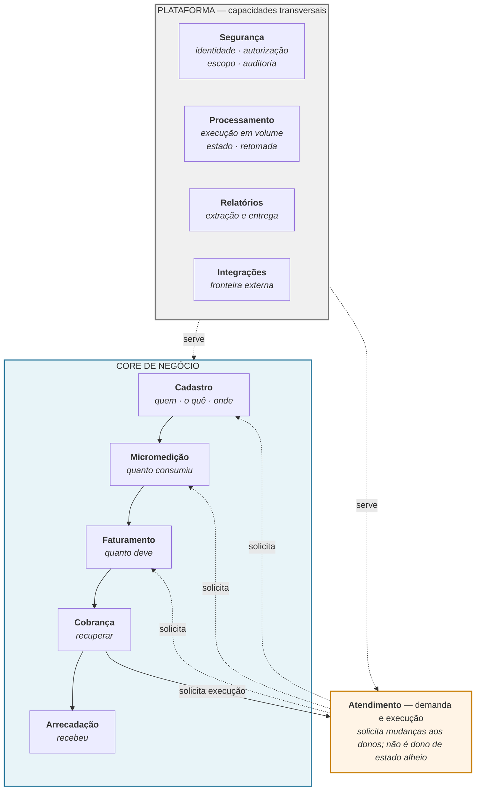
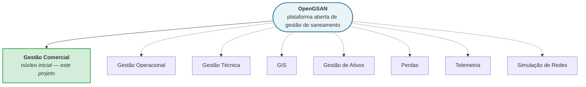

# Visão Conceitual Alvo do OpenGSAN

> **Procedência**: consome o [mapa de domínio](mapa-de-dominio.md), a [análise de compatibilidade](../compatibilidade/estruturas-centrais.md) (64 decisões), o [glossário](glossario.md), as [divergências aprovadas](../compatibilidade/divergencias-aprovadas.md) e as ADRs 0001–0007. Método e níveis de certeza em [`procedencia.md`](../procedencia.md).
>
> ⚠️ **Este documento é conceitual.** Não contém — e não pode conter — tabelas, colunas, tipos, chaves, índices, schemas, migrations, entidades JPA, DTOs, APIs, mensageria, eventos ou layouts de tela. Onde uma decisão exigiria escolher mecanismo, o documento define **responsabilidade** e para.

---

## 1. Visão

> **OpenGSAN é a evolução aberta, moderna e sustentável do GSAN para gestão de saneamento básico.**

O sistema nasce de uma constatação que a Fase 0 documentou com evidência: **o GSAN sabe muito sobre saneamento e pouco sobre engenharia de software moderna**. Das 64 decisões estruturais analisadas, 37 foram `PRESERVAR` — o modelo funcional é majoritariamente bom, e nos módulos financeiros, onde o risco é maior, é o mais preservado de todos (7 de 10 no Faturamento).

A pergunta que este documento responde é:

> Se preservarmos o conhecimento funcional válido do GSAN e removermos suas limitações técnicas, **como deve ser organizado conceitualmente** um sistema moderno de gestão de saneamento?

⚠️ Não responde "como migrar o GSAN" nem "como manter dois sistemas funcionando juntos" — ambos estão fora do escopo (§3).

---

## 2. Relação com o GSAN

```text
GSAN
  │  décadas de conhecimento funcional validado em operação real:
  │  conceitos · regras de negócio · fluxos · nomenclaturas · relações de domínio
  ▼
OpenGSAN
  ├── arquitetura moderna          (fronteiras explícitas, sem acoplamento por acidente)
  ├── código sustentável           (sem EJB 2.x, sem herança de controlador por companhia)
  ├── segurança moderna            (as divergências aprovadas D-01…D-16 são obrigatórias)
  ├── extensibilidade              (configuração antes de fork)
  └── evolução funcional           (o que o GSAN ainda não faz)
```

🔵 **O que o OpenGSAN herda**: o domínio. 🔵 **O que não herda**: a implementação.

⚠️ Três leituras erradas a evitar:

| Leitura errada | Por que é errada |
| -------------- | ---------------- |
| "Produto novo, desconectado do GSAN" | Descartaria conhecimento funcional validado por operação real em múltiplas companhias |
| "Atualização tecnológica do código antigo" | Perpetuaria as 14 reestruturações identificadas e as falhas de segurança documentadas |
| "Cópia do modelo de dados com tecnologia nova" | O mapa de domínio provou que o Imóvel acumulou estado de outros domínios e a Economia não tem forma explícita |

---

## 3. Escopo do projeto

### 3.1 Dentro do escopo

Construir o OpenGSAN como sistema moderno e funcional de **gestão comercial de saneamento**: cadastro, micromedição, faturamento, cobrança, arrecadação, atendimento e ordens de serviço, sustentados por segurança, processamento em lote, relatórios e integrações.

### 3.2 ⚠️ Fora do escopo — migração de instalações GSAN

🔴 **Decisão de 2026-09-15 (ADR-0005 revisada)**: migração gradual, coexistência GSAN + OpenGSAN, sincronização, migração módulo a módulo, ETL operacional, cutover, replicação e compatibilidade entre bancos em execução **serão tratados em projeto separado**.

🔵 **Consequência de desenho, que é o ponto**: a forma do legado **deixa de ser restrição**. Onde a análise indicou `REESTRUTURAR`, reestrutura-se — e o projeto de migração fará a transformação quando existir. Facilidade de migração **não justifica** manter tabelas ruins, acoplamentos, chaves artificiais, estruturas duplicadas ou segurança inadequada.

### 3.3 O que permanece, apesar disso

**Continuidade conceitual** permanece requisito — por razão diferente: *o GSAN contém décadas de conhecimento funcional que não deve ser descartado*. Preserva-se conceito, nomenclatura útil, regra de negócio, identidade relevante, comportamento financeiro, histórico e parametrização **porque valem por si**, não porque facilitam transporte de dados.

### 3.4 Fora desta execução

Funcionalidades futuras (PIX, NF, SPED, telemetria, BI, boleto registrado, GIS avançado, novas integrações móveis) **não** entram no núcleo agora — terão catálogo próprio na próxima atividade. Domínios futuros (operacional, técnico, ativos, perdas, simulação de redes) não são modelados aqui (§27).

---

## 4. Princípios

Seis princípios, todos derivados de evidência da Fase 0 — nenhum é preferência estética.

| # | Princípio | De onde vem |
| - | --------- | ----------- |
| **P1** | **Regra como dado** — comportamento relevante é parametrizável, não recompilável | 16 famílias paramétricas no GSAN, **nenhuma descartada** na análise |
| **P2** | **Identidade, versão e linhagem são três coisas distintas** — nunca confundidas | O projeto já confundiu identidade estável com linhagem e precisou corrigir |
| **P3** | **Snapshot é requisito, não redundância** — o contexto do cálculo é congelado quando o original vai mudar | Comprovado no código: *"o percentual do imóvel pode mudar depois; a conta precisa reproduzir o cálculo original"* |
| **P4** | **Informado × efetivo** — o observado nunca é sobrescrito pelo decidido | Padrão em 8 lugares do GSAN; é auditoria embutida no modelo |
| **P5** | **Só o dono altera o estado do seu conceito** | O legado viola isso (retificação escreve em `ConsumoHistorico`); é a divergência D-14 |
| **P6** | **Configuração antes de fork** — variar sem alterar o núcleo | 7 subclasses de controlador por companhia + métodos `*CAER` no núcleo compartilhado |

### 4.1 O princípio que ordena os outros

🔵 **Conceito ≠ estrutura.** Onze das decisões de compatibilidade têm o formato *"preservar a semântica, reestruturar a representação"*. Este documento define **semântica**; a estrutura vem depois.

---

## 5. Software livre

OpenGSAN será **software livre e aberto para gestão de saneamento**. Isso não é rótulo — tem consequência arquitetural direta:

| Consequência | O que significa na prática |
| ------------ | -------------------------- |
| **Neutralidade institucional** | ⚠️ Nenhum nome de empresa, regra local, URL fixa, credencial ou campo institucional específico no núcleo. O GSAN falha nisso (`numeroCelpe`, DV CAERN, `calcularValorFaturadoFaixaCAER`, domínios `cosanpa` no filtro de API) |
| **Configuração antes de fork** | Uma companhia deve conseguir usar o OpenGSAN **sem manter um fork** (§25) |
| **Documentação clara** | A Fase 0 já é isso: dez mapas funcionais, glossário, domínio, compatibilidade — todos com evidência citada |
| **Instalação reproduzível** | Quem clona deve conseguir subir o sistema seguindo apenas a documentação |
| **Testes reproduzíveis** | Massa sintética; nenhum teste dependente de base de companhia |
| **Sem dependência desnecessária de fornecedor** | Banco, fila, storage e identidade escolhidos por necessidade técnica, não por contrato |

⚠️ **Licença não decidida** — decisão de governança, registrada como pendente (§28).

---

## 6. Visão macro



🔵 **A distinção que o diagrama carrega**: o **core** resolve o negócio; a **plataforma** oferece capacidades ao core. ⚠️ Não são dez módulos equivalentes — Segurança, Processamento, Relatórios e Integrações têm natureza diferente de Faturamento, e tratá-los como iguais foi diagnosticado como erro potencial de desenho no mapa de domínio.

---

## 7. Core de negócio

🔵 Cada elo da cadeia **transforma a informação de natureza**, não só de formato — e essa é a razão de serem módulos distintos:

```text
Cadastro      ESTADO           "3 economias residenciais, ligação ativa, setor 12"
Micromedição  QUANTIDADE       "24 m³ na referência, por leitura real"
Faturamento   VALOR + DOCUMENTO "R$ 187,43, vence dia 15" + contexto congelado
Cobrança      OBRIGAÇÃO EM RISCO "vencida há 40 dias, elegível a aviso de corte"
Arrecadação   FATO FINANCEIRO  "entrou R$ 187,43 em 14/03, aplicado a esta conta"
```

🔵 **O que sincroniza a cadeia** — e deve ser preservado: o **ciclo de faturamento** (agrupamento operacional com cronograma) e a **referência de competência**. Leitura e faturamento são fases do mesmo ciclo mensal.

🔵 **Atendimento é o sexto módulo do core, com papel distinto**: participa de três dos sete ciclos de dependência mapeados e é o canal por onde mudanças entram nos outros domínios. É core porque tem domínio próprio (demanda e execução), e é ponte porque **solicita** mudanças — sem ser dono delas (§14).

---

## 8. Plataforma

| Capacidade | Responsabilidade | ⚠️ O que **não** é |
| ---------- | ---------------- | ------------------ |
| **Segurança** | Identidade, autorização, escopo territorial, auditoria | Não é dona de regra de negócio; não decide *o que* pode ser feito, só *quem* pode |
| **Processamento** | Executar trabalho em volume, particionado, com estado, retomada e reprocessamento | ⚠️ **Não é dona de regra de negócio.** Comprovado no GSAN e a preservar: o orquestrador controla estado; o módulo dono executa a regra |
| **Relatórios** | Receber solicitação parametrizada, decidir modo de execução, produzir e entregar o artefato | ⚠️ Não é dona das consultas: a regra pertence ao módulo dono do dado |
| **Integrações** | Fronteira com o mundo externo: contrato, autenticação, validação, idempotência, transformação, erro, observabilidade | 🔴 **Uma integração não é dona do domínio.** Ela traduz e entrega; quem aplica o efeito é o módulo dono |

🔵 **Por que plataforma e não módulo de negócio**: as quatro são **usadas por todos** e **não possuem conceitos de negócio próprios** além dos seus instrumentos. Um relatório de faturamento pertence ao Faturamento; o motor que o executa pertence à plataforma.

---

## 9. Cadastro

### 9.1 Responsabilidade

Descrever **quem** (cliente), **o quê** (imóvel, suas economias, ligações e classificação) e **onde** (estrutura territorial). É a base de referência comercial: não fatura, não cobra, não arrecada — fornece identidade, classificação e estado.

### 9.2 Conceitos

| Conceito | Tratamento | Nota |
| -------- | ---------- | ---- |
| **Imóvel** | Preservado como **identidade central** | A matrícula é identificador público reconhecido por clientes e operadores |
| **Cliente** | Preservado | Pessoa identificada por documento fiscal |
| **Cliente × Imóvel** | Preservado **com papel, vigência e motivo de encerramento** | 🔴 Reduzir a um vínculo simples destruiria a responsabilização por período — que sustenta cobrança e negativação de dívida antiga |
| **Economia** | 🔴 **Reestruturado** — ver §9.4 | Conceito tarifário central sem forma explícita hoje |
| **Categoria / Subcategoria** | Preservado, **incluindo os limiares de análise de consumo** | ⚠️ Não é rótulo: é parametrização usada pela Micromedição para criticar consumo |
| **Ligação de Água / Esgoto** | Preservada como conceito, **com identidade própria** — ver §9.5 | |
| **Estrutura territorial** | Preservada | Base do ciclo operacional **e do escopo de segurança** |

### 9.3 🔴 Correção estrutural: o Imóvel deixa de guardar estado alheio

🟢 **Problema herdado**: o registro do imóvel concentra situação das ligações, situação de cobrança, contadores de parcelamento e parâmetros de faturamento — estado que pertence a **outros domínios**. É a causa estrutural do acoplamento e das 123 referências ao imóvel.

**No OpenGSAN**: o Imóvel expõe o que é seu (identificação, localização, características, classificação, vínculos). O estado de ligação pertence à Ligação; o estado de cobrança pertence à Cobrança; o histórico de negociação pertence ao Parcelamento.

⚠️ **Toda a informação continua existindo e consultável pelos mesmos processos** — muda quem é responsável por ela.

### 9.4 🔴 Economia

🟢 **Problema herdado**: três representações concorrentes (agregada por subcategoria, total denormalizado, individualizada), com **apenas uma governando o cálculo**. Usar a errada muda o valor da conta.

**Semântica a preservar**: a economia é a **unidade tarifária** — mínimos e faixas aplicam-se por economia dentro da categoria. É preciso saber **quantas economias, por subcategoria**, e essa composição governa o cálculo.

**No OpenGSAN**, três coisas separadas:

1. **Conceito tarifário** — economia como unidade de aplicação de tarifa. Primeira classe, explícito.
2. **Composição** — quantidade por subcategoria. É a **fonte de verdade** do cálculo; o total é derivado, não armazenado em paralelo.
3. **Individualização** — ⚠️ **só existe se o negócio exigir.** Não forçar uma entidade por economia: a evidência mostra uso apenas informativo, e não se sabe se toda instalação a popula. Decidir ao implementar o módulo (§28).

### 9.5 Ligações

**Semântica preservada**: cada imóvel tem **no máximo uma** ligação de cada tipo; a ligação tem características técnicas, eventos datados e percentuais que o Faturamento usa; e **a situação da ligação comanda faturabilidade e cobrança**.

🔴 **O que não se preserva**: a chave compartilhada com o imóvel. 🔵 **Preservar a cardinalidade 1:1 não exige preservar a chave compartilhada** — a cardinalidade vira *restrição*, a ligação ganha identidade própria e ciclo de vida, e **o estado corrente passa a morar na ligação**, não no imóvel.

🟡 **Ponto a resolver ao implementar**: o GSAN não tem histórico de situações da ligação — o detalhe dos eventos fica nas ordens de serviço. Avaliar se o histórico de situação passa a ser de primeira classe.

---

## 10. Micromedição

### 10.1 Responsabilidade

🔴 **A Micromedição é dona do consumo.** Nenhum outro módulo o altera diretamente — inclusive na retificação (divergência D-14).

### 10.2 Conceitos

| Conceito | Tratamento |
| -------- | ---------- |
| **Hidrômetro** (equipamento) | 🔴 **Preservado como distinto da instalação** — identidade própria, ciclo próprio (estoque → instalado → manutenção → baixa) |
| **Instalação** | 🔴 **Preservada como o elo datado** entre equipamento e ligação/imóvel, com **leituras de fronteira** |
| **Leitura** | Preservada, **com o par informado × efetivo** |
| **Consumo** | Preservado por **imóvel + referência + tipo de ligação**, com **origem tipificada** |
| **Média** | Preservada como insumo multiuso (faturar sem leitura, criticar consumo, gerar faixa esperada) |
| **Anormalidades** | 🔴 **Preservadas como parametrização** — de leitura e de consumo, com ações escalonadas por reincidência |

### 10.3 O que é inegociável

🔴 **Equipamento ≠ instalação.** A separação é o que permite calcular consumo no mês de troca sem perder continuidade, e o que mantém a série histórica pertencendo ao **imóvel**, não ao equipamento.

🔴 **Três valores distintos de consumo no mês**: faturado (virou dinheiro), para cálculo de média (expurgado de anormalidades), medido (fato bruto). ⚠️ Colapsá-los corrompe médias e críticas em cascata.

🔴 **Origem do consumo é semântica, não metadado**: real, média, mínimo, fixado, rateio. É o que explica por que uma conta saiu com determinado valor.

🔴 **Anormalidade não vira `enum`.** O catálogo define comportamento (qual consumo cobrar, qual leitura faturar, se emite ordem de serviço) e **varia por companhia**.

### 10.4 Contrato com o Faturamento

```text
Faturamento  ──► pede consumo da referência          ──►  Micromedição responde
Faturamento  ──► solicita correção (retificação)     ──►  Micromedição aplica, com motivo e versão
Faturamento  ──► orquestra apuração de condomínio    ──►  Micromedição calcula e grava
```

⚠️ A terceira linha é colaboração legítima (existe hoje e permanece). A segunda **corrige a divergência D-14**: hoje o Faturamento escreve direto.

---

## 11. Faturamento

### 11.1 Responsabilidade

Transformar estado do cadastro + consumo em **documento de cobrança**, decidindo faturabilidade, valorando pela tarifa vigente, agregando débitos, créditos e impostos, e mantendo o ciclo de vida do documento.

### 11.2 🔴 Postura conservadora — declarada

⚠️ Este é o módulo onde **menos se muda**. Sete das dez decisões foram `PRESERVAR`, apesar de ser o de maior risco financeiro. Toda mudança aqui move dinheiro de cliente.

| Conceito | Tratamento |
| -------- | ---------- |
| **Referência de competência** | Preservada, **distinta da referência contábil** |
| **Ciclo/agrupamento de faturamento** | Preservado — o cronograma sincroniza leitura, cálculo, emissão e vencimento |
| **Estrutura tarifária** | 🔴 Preservada integralmente: tarifa → **vigência datada** → categoria (mínimo) + faixas progressivas |
| **Cálculo de água e esgoto** | Preservado, incluindo percentuais por imóvel e degrau por faixa de consumo |
| **Conta** | Preservada como documento com **contexto congelado** |
| **Débito / Crédito em dois momentos** | Preservados (lançado × efetivado) |
| **Retificação** | 🔴 Preservada como **linhagem** (§21) |
| **Cancelamento** | Preservado como **estado com motivo** — nunca exclusão |
| **Precisão financeira** | 🔴 **Preservada como comportamento** — ver §11.4 |

### 11.3 Snapshots

🔴 **Preservados, e a razão precisa ficar explícita para não serem "otimizados" depois**: a conta congela situações das ligações, percentuais, tarifa, clientes da emissão e composição por categoria **porque o original vai mudar**. Uma conta de 2019 precisa ser recalculável hoje com o imóvel já tendo trocado de categoria, percentual, tarifa e dono.

⚠️ Parecem desnormalização. **Não são.** São o mecanismo de auditoria retroativa, e removê-los produz um defeito que só aparece meses depois, numa contestação.

### 11.4 🔴 Precisão financeira

🟢 O GSAN usa **cinco políticas semânticas de arredondamento** no núcleo de cálculo, incluindo truncamento na base de imposto.

⚠️ **Isso é comportamento de negócio, não dívida técnica.** Unificar tudo em uma política alteraria valores cobrados do cliente sem decisão de negócio.

**No OpenGSAN**: cada ponto de cálculo declara **explicitamente** sua política de arredondamento, nomeada e testável. 🔵 O que muda é a **visibilidade** (hoje está implícita e espalhada); o **resultado** não muda. Qualquer alteração de política vira divergência registrada e aprovada — nunca decisão técnica silenciosa.

---

## 12. Cobrança

### 12.1 Responsabilidade

Acompanhar a obrigação financeira **depois** do faturamento: identificar dívida elegível, executar ações escalonadas, negociar, acionar execução operacional e manter rastreabilidade.

🔵 **A Cobrança não cria a dívida original** — atua sobre obrigações do Faturamento. Cria apenas as **derivadas** da própria negociação (prestações, juros, sanções, estornos).

| Conceito | Tratamento |
| -------- | ---------- |
| **Elegibilidade** | Preservada como **critério paramétrico**, distinta de "dívida existente" |
| **Política de cobrança** | 🔵 Formalizada — ver §12.3 |
| **Ação de cobrança** | Preservada com **predecessora, critério, situações-alvo e serviço que gera** |
| **Documento de cobrança** | Preservado **com itens rastreáveis dívida a dívida** |
| **Parcelamento** | 🔴 Preservado com **composição por item e memória financeira integral** |
| **Prestação** | Preservada como obrigação tipificada que entra em documentos futuros |
| **Reparcelamento** | Preservado como **linhagem** (§21) |
| **Situação especial de cobrança** | Preservada com motivo, comando e histórico |
| **Negativação** | Preservada como **domínio** (do cliente, por critério) — a integração é outra coisa (§18) |

### 12.2 🔴 Estoque de dívida

**Semântica**: "quanto este imóvel/cliente deve" é uma **pergunta respondida por consulta** sobre documentos não quitados — não existe tabela de dívida, e o pagamento a reduz porque a consulta passa a deduzi-lo.

🔵 **Avaliação (não por desempenho nem por estética)**: o modelo derivado é **conceitualmente correto** — evita o problema clássico de saldo desatualizado, e torna impossível a dívida divergir dos documentos que a compõem. **Permanece derivado.**

⚠️ O que **merece formalização** é a **consulta em si** como conceito nomeado do domínio ("posição de dívida de um imóvel/cliente numa data, sob um recorte"), em vez de existir como método de repositório. 🔵 Formalizar o conceito ≠ materializar o dado.

### 12.3 🔵 Política de cobrança — conceito a formalizar

🟢 Hoje a política emerge da combinação de ação + predecessora + critério + situações-alvo + cronograma/comando — existe como **dado disperso**, sem nome.

**Proposto**: nomear o conceito. A política declara *quando agir, sobre quem, com que instrumento e o que vem depois*. ⚠️ **Não é entidade nova de dados** — é dar nome ao que já existe, tornando-o simulável antes de executar.

---

## 13. Arrecadação

### 13.1 🔴 Quatro momentos distintos — preservados separadamente

```text
RECEBIMENTO    o dinheiro chegou            (registro bruto preservado, com totais de conferência)
     ↓
CLASSIFICAÇÃO  a que obrigação corresponde  (resultado tipificado, inclusive "não foi possível")
     ↓
APLICAÇÃO      o efeito sobre a obrigação   (a posição de dívida deduz o recebimento)
     ↓
CONCILIAÇÃO    bate com o que o banco diz   (calculado × informado, com acertos e deduções)
```

🔵 **Por que separar importa**: o recebimento é reconhecido **antes** de se saber a quem pertence. Isso garante que nada se perde por não casar — e é o que sustenta o tratamento do não classificado.

### 13.2 Conceitos

| Conceito | Tratamento |
| -------- | ---------- |
| **Recebimento (pagamento)** | 🔴 Preservado **com identidade estável** — ver §13.3 |
| **Resultado da classificação** | 🔴 Preservado como **catálogo semântico** com resultado anterior mantido |
| **Movimento do arrecadador** | Preservado **com o registro bruto** — permite auditoria e reprocessamento da origem |
| **Aviso bancário** | Preservado como **conciliação calculado × informado** |
| **Devolução** | Preservada como entidade própria, simétrica ao recebimento |
| **Débito automático** | Preservado **em três níveis** (adesão × envio de um documento × pagamento efetivo) |
| **Fechamento de competência** | Preservado como **fechamento financeiro/contábil**, distinto de arquivamento |

### 13.3 🔴 Identidade do recebimento

🟢 **Anomalia herdada**: no GSAN o pagamento **perde o identificador ao ser arquivado** — única exceção ao padrão de identidade do sistema. A análise concluiu: **limitação estrutural, não necessidade funcional.**

**No OpenGSAN**: o recebimento tem **identidade estável por toda a sua vida**, como todo documento financeiro.

### 13.4 O princípio a preservar

🔴 **Nenhum recebimento é descartado.** Não conseguir aplicar o dinheiro é um **resultado nomeado** (duplicidade, documento inexistente, valor divergente, documento cancelado/prescrito/parcelado, competência ainda aberta), não uma ausência de registro. O resultado anterior é preservado quando há reclassificação.

---

## 14. Atendimento

### 14.1 Responsabilidade

Domínio da **demanda** e da sua **execução** — e canal por onde mudanças entram nos outros domínios.

| Conceito | Tratamento |
| -------- | ---------- |
| **Registro de atendimento (RA)** | Preservado como **protocolo da demanda** — compromisso com prazo, comunicado ao cliente |
| **Ordem de serviço (OS)** | Preservada como **unidade de execução** |
| **RA × OS** | 🔴 **Preservado opcional nos dois sentidos** — ver §14.2 |
| **Especificação da solicitação** | Preservada como **núcleo paramétrico**, com versionamento acrescentado (§23) |
| **Tipo de serviço** | Preservado como **segundo nível de regra** |
| **Tramitação** | 🔴 Preservada como **histórico auditável**, com responsável × quem registrou |
| **Prazo** | Preservado com **original × atual** |
| **Espera e reiteração** | 🔴 **Reestruturados** — passam a ter histórico (hoje sobrescrevem) |

### 14.2 🔴 RA e OS não são 1:1

⚠️ **Não transformar em relação 1:1.** Evidência: existe RA sem OS (demanda informativa), RA com várias OS, e OS nascidas de processo interno (cobrança, fiscalização coletiva, ordem seletiva) sem demanda individual.

🔵 **Encerrar ≠ executar** — o GSAN distingue explicitamente a OS encerrada com execução da encerrada sem execução, e isso decide se o serviço é cobrado. Preservado.

### 14.3 🔴 Efeito operacional — o contrato central

🟢 **Como o GSAN faz** (e é melhor do que parece): o efeito não é gatilho automático do encerramento — é resultado da **operação de negócio específica**, que atualiza o domínio dono e **marca a OS** de que o efeito já foi aplicado.

**No OpenGSAN, formalizado:**

```text
OS executada
     ↓ solicita o efeito
módulo DONO aplica          ligação    → Cadastro
     ↓                      hidrômetro → Micromedição
estado alterado no dono     financeiro → Faturamento / Cobrança
     ↓
OS registra que o efeito foi aplicado
```

🔴 **O Atendimento nunca é dono do dado que altera.** Ele origina, solicita e registra; o dono aplica. ⚠️ Não mover a propriedade desses estados para o Atendimento "porque é ele quem dispara".

---

## 15. Segurança

> ⚠️ **As divergências D-01, D-02, D-03, D-06, D-07 e D-16 são obrigatórias** e têm precedência sobre qualquer equivalência com o legado.

### 15.1 Conceitos preservados

| Conceito | Tratamento |
| -------- | ---------- |
| **Usuário** | Preservado, com **estado, bloqueio e expiração como eixos independentes** |
| **Grupo** | Preservado como perfil funcional; **concessões de múltiplos grupos se somam** |
| **Funcionalidade / Operação** | Preservadas como unidade de concessão — ⚠️ com **identificador estável**, não a URL (§15.2) |
| **Permissão especial** | Preservada como **capacidade nomeada** para exceções dentro da funcionalidade |
| **Escopo territorial (abrangência)** | 🔴 Preservado como conceito, **garantido por construção** (§15.3) |
| **Unidade organizacional** | Preservada como **posicionamento de fluxo** — ⚠️ **não é autorização** |
| **Auditoria** | Preservada em **dois níveis** (§22.2) |
| **Solicitação de acesso** | Preservada — é **governança**, não cadastro paralelo |

### 15.2 Concessão desacoplada da apresentação

🟢 **Problema herdado**: a concessão é ancorada no caminho HTTP da tela. O OpenGSAN não terá esses caminhos, e a decisão de interface (ADR-0007) ainda está pendente.

**No OpenGSAN**: funcionalidade e operação têm **identificador estável de domínio**, independente da tecnologia de apresentação. 🔵 Efeito colateral valioso: a decisão da ADR-0007 deixa de afetar o modelo de segurança.

### 15.3 🔴 Escopo territorial garantido, não lembrado

🟢 **Problema herdado**: o modelo de abrangência está correto, mas **sua aplicação depende de cada consulta chamá-la**. Uma consulta nova que esqueça vaza dados de outro território, em silêncio.

**No OpenGSAN**: o escopo é aplicado **sistematicamente**. ⚠️ Isso é a **divergência D-17 (proposta, não aprovada)** — altera comportamento visível: consultas que hoje retornam dados passariam a restringi-los. É correção, não regressão, mas precisa de aprovação.

### 15.4 Eliminado conceitualmente

🔴 Hash sem salt, autenticação por consulta que casa login+hash, contagem de tentativas em sessão, token efêmero sem escopo, pseudo-autenticação por host, filtros decorativos, credenciais versionadas. ⚠️ **A semântica de cada controle é preservada** (validar credencial, histórico de senha, blacklist, bloqueio, expiração); o mecanismo é substituído.

---

## 16. Processamento

### 16.1 Modelo preservado

```text
PROCESSO    o que se executa                   (definição catalogada)
  └─ ETAPA  em que ordem, com que partição     (ordem é DADO, não código)
      └─ UNIDADE  a partição concreta          (identificador real do objeto particionado)
           └─ EXECUÇÃO  estado · tempos · parâmetros · erro — PERSISTIDOS
```

🔴 **O que isso dá ao negócio**, e é raro: responder *quem pediu, quando, com quais parâmetros, quais etapas rodaram, qual partição falhou, qual foi o erro e o que já está concluído* — **sem depender de log técnico**.

### 16.2 Propriedades inegociáveis

| Propriedade | Por quê |
| ----------- | ------- |
| **Retomada por unidade** | Unidade concluída não se repete. Em processamento financeiro, reprocessar sem isso **duplica efeito de dinheiro** |
| **Falha por unidade** | As demais seguem; o erro é persistido e consultável |
| **Reprocessamento por etapa** | Operação real do dia a dia |
| **Autorização de processo** | Governança de processos sensíveis, distinta da permissão de operar a tela |
| **Identidade do solicitante** | Rastreabilidade de quem pediu |
| **Ordem das etapas como dado** | Configurabilidade sem código |
| 🔴 **O dono da regra é o módulo de negócio** | O orquestrador controla estado; nunca calcula |

### 16.3 Eliminado

🔴 **Transporte técnico não é conceito de domínio**: filas e agendadores legados, beans de mensagem, e **contexto de execução serializado como objeto binário da linguagem** — este último porque amarra a leitura do contexto a um runtime específico.

**No OpenGSAN**: o contexto de execução é **legível e inspecionável** sem executar. ⚠️ Qual tecnologia agenda e distribui **não é decisão deste documento**.

---

## 17. Relatórios

| Conceito | Tratamento |
| -------- | ---------- |
| **Definição** | Preservada — o tipo catalogado |
| **Solicitação** | Preservada — parametrizada, executável, com solicitante |
| **Resultado (artefato)** | Preservado — ligado à execução e, por ela, ao solicitante |

🔵 **Decisão automática de modo de execução preservada**: o sistema estima o volume e decide entre execução interativa e assíncrona, **sem exigir escolha do operador**. Bom desenho; permanece. ⚠️ O limite sai de arquivo versionado e vira parametrização governada.

🔴 **O artefato pertence ao solicitante.** A recuperação verifica propriedade e escopo — divergência **D-03**, obrigatória.

⚠️ **O motor de relatório não faz parte do domínio.** Qual biblioteca preenche o modelo e exporta o formato é decisão de implementação. 🔵 O domínio define: o que se pede, quem pode pedir, quem pode ver o resultado, e o que o resultado contém.

---

## 18. Integrações

### 18.1 🔴 A camada que precisa existir

🟢 **O GSAN não tem camada de integração** — tem sete padrões técnicos independentes, sem política comum, com maturidade que vai de autenticação por credencial em repositório seguro até chave de API em constante de código.

**No OpenGSAN, a fronteira externa é uma capacidade com responsabilidades declaradas:**

| Responsabilidade | O que significa |
| ---------------- | --------------- |
| **Contrato** | O formato e a semântica do que entra e sai, versionados e documentados |
| **Autenticação** | 🔴 Toda origem externa é identificada — **sem exceção** (divergências D-04, D-05, D-06, D-11) |
| **Validação** | O que chega é verificado antes de alcançar o domínio |
| **Idempotência** | Reenvio não duplica efeito — **por chave de negócio**, não por exceção de banco engolida |
| **Transformação** | Tradução entre o formato externo e o vocabulário do domínio |
| **Erro** | 🔴 **Durável e observável.** Falha não vira `continue` silencioso: vira registro consultável |
| **Observabilidade** | Quanto entrou, quanto falhou, o que está pendente |

### 18.2 🔴 Uma integração não é dona do domínio

🔵 Ela **traduz e entrega**; o módulo dono aplica o efeito. Uma leitura que chega do campo é aplicada pela Micromedição; uma OS encerrada em campo é aplicada pelo Atendimento e propagada ao dono do efeito.

### 18.3 Capacidades preservadas · implementações descartadas

| Capacidade (preservada) | Implementação herdada (não transportada) |
| ----------------------- | ---------------------------------------- |
| Coleta em campo (baixar rota, enviar leitura, finalizar) | Protocolo binário por opcode sem autenticação |
| OS móvel (listar, encerrar, enviar fotos) | Endpoints de escrita sem credencial; componente com estado compartilhado |
| Troca com executante terceirizado | 🔴 **Escrita direta no banco do parceiro**; falha silenciosa |
| Consulta a birô de crédito | Transporte obsoleto |
| Arquivos bancários | Análise de layout dentro do controlador de domínio |
| Notificação ao cliente | Segredo em código; transporte em claro; tipo de mensagem ignorado |

---

## 19. Ownership

> 🔴 **Princípio**: *só o módulo dono altera o estado do seu conceito.*

| Conceito | **Dono** | Consumidores | Estado autoritativo |
| -------- | -------- | ------------ | ------------------- |
| Imóvel · Cliente · Cliente×Imóvel | **Cadastro** | Todos | Cadastro |
| Economias · Categoria/Subcategoria | **Cadastro** | Faturamento (tarifa), Micromedição (críticas) | Cadastro |
| Estrutura territorial | **Cadastro** | Todos; Segurança (escopo) | Cadastro |
| **Ligação** e sua situação | **Cadastro** | Faturamento, Cobrança, Micromedição | 🔴 **A Ligação** (hoje é o Imóvel) |
| Hidrômetro · Instalação | **Micromedição** | Cadastro (consulta), Atendimento (solicita) | Micromedição |
| Leitura · Consumo · Média | **Micromedição** | Faturamento | 🔴 **Micromedição, sempre** (hoje a retificação escreve direto) |
| Conta e seu contexto | **Faturamento** | Cobrança, Arrecadação, Relatórios | Faturamento |
| Tarifa · vigência · faixas | **Faturamento** | Micromedição (mínimo) | Faturamento |
| Débito · Crédito · Guia | **Faturamento** | Cobrança (cria derivados **através dele**), Arrecadação, Atendimento | Faturamento |
| Posição de dívida | **Cobrança** | Atendimento, Arrecadação | 🔵 Derivada dos documentos |
| Política · Ação · Documento de cobrança | **Cobrança** | Atendimento (execução) | Cobrança |
| Parcelamento e sua memória | **Cobrança** | Faturamento (prestações) | Cobrança |
| Situação de cobrança do imóvel | **Cobrança** | Cadastro (consulta) | 🔴 **Cobrança** (hoje é o Imóvel) |
| Recebimento · Devolução · Conciliação | **Arrecadação** | Cobrança, Faturamento | Arrecadação |
| RA · OS · Tramitação | **Atendimento** | Cobrança, Micromedição, Faturamento | Atendimento |
| Especificação · Tipo de serviço | **Atendimento** | — | Atendimento |
| Usuário · Grupo · Concessão · Escopo | **Segurança** | Todos | Segurança |
| Execução em lote | **Processamento** | Todos | Processamento |
| Definição/solicitação/artefato de relatório | **Relatórios** | Todos | Relatórios |
| Contratos de fronteira externa | **Integrações** | Módulos donos do efeito | 🔵 Integrações detém o **contrato**; o efeito é do dono |

🔵 **Três mudanças de propriedade** em relação ao GSAN, todas para corrigir estado guardado no lugar errado: situação da ligação, situação de cobrança e escrita de consumo na retificação.

---

## 20. Fronteiras

⚠️ Esta seção define **responsabilidade**, não mecanismo. Se a chamada será método, evento, API ou mensagem **não é decidido aqui**.

### 20.1 Regra

🔴 **Nenhum módulo escreve no estado interno de outro.** Quem precisa de mudança **solicita**; o dono decide, aplica e responde.

```text
Faturamento  ──solicita──►  "corrigir consumo da referência X, motivo Y"
                                          │
                            Micromedição valida, aplica, versiona e responde
```

### 20.2 Fronteiras principais

| Fronteira | O que atravessa | Quem decide |
| --------- | --------------- | ----------- |
| Cadastro → Micromedição | Imóvel, ligação e situação, estrutura de campo, limiares de categoria | Cadastro é dono; Micromedição consome |
| Micromedição → Faturamento | Consumo com origem, leituras, mínimo calculado, média | Micromedição é dona |
| Faturamento ← Micromedição | **Solicitação de correção de consumo** | 🔴 Micromedição decide e aplica |
| Faturamento → Cobrança | Documentos e sua situação | Faturamento é dono |
| Cobrança → Faturamento | **Solicitação de lançamentos derivados** (prestações, juros, estornos) | 🔴 Faturamento cria e é dono |
| Faturamento/Cobrança → Arrecadação | Obrigações passíveis de recebimento | Faturamento/Cobrança são donos |
| Arrecadação → Cobrança | Recebimentos aplicados | 🔵 A posição de dívida os reflete por derivação |
| Cobrança → Atendimento | **Solicitação de execução operacional** | Atendimento executa |
| Atendimento → donos | **Solicitação de efeito** (ligação, hidrômetro, financeiro) | 🔴 O dono aplica |
| Segurança → todos | Identidade, autorização, escopo | Segurança é dona |
| Processamento → todos | Orquestração; **nunca regra de negócio** | Módulo dono executa a regra |

### 20.3 Ciclos que permanecem

🔵 O mapa de domínio identificou **sete ciclos de dependência**. Eles **não desaparecem** — são de negócio, não acidentais (uma ligação nasce de atendimento e seu estado vive no cadastro; uma anormalidade de leitura gera ordem de serviço).

⚠️ **O que muda**: o ciclo passa a ser de **solicitação/resposta entre responsáveis**, não de escrita cruzada em estado alheio.

---

## 21. Identidade, versão e linhagem

🔴 **Três conceitos distintos.** Confundi-los quebra rastreabilidade financeira — e este projeto já cometeu essa confusão uma vez.

```text
IDENTIDADE ESTÁVEL   o documento é o mesmo, onde quer que esteja armazenado
        ↓
VERSÃO               representações do MESMO documento (corrente, arquivado, impresso)
        ↓
HISTÓRICO            o documento saiu do fluxo corrente e continua existindo e sendo consultado
        ↓
LINHAGEM             um documento SUBSTITUI outro — identidades DIFERENTES, encadeadas
```

| | Identidade + versão | Linhagem |
| --- | --- | --- |
| **Pergunta** | "É o mesmo documento?" | "Qual documento substituiu qual?" |
| **Identificador** | **O mesmo** | **Diferente**, com vínculo de origem |
| **Exemplo** | Conta arquivada no fechamento | Conta retificada → nova conta |
| **Quebrar isso causa** | Pagamento órfão de conta arquivada | Perda da cadeia de correções |

### 21.1 Aplicação

🔵 **A linhagem é padrão de domínio, não peculiaridade do faturamento**: aparece em conta retificada, RA reativado/duplicado, OS de referência e reparcelamento. *O OpenGSAN nunca reescreve um documento: cria outro e liga ao anterior.*

### 21.2 ⚠️ O que **não** se herda

O OpenGSAN **não** precisa repetir a implementação do GSAN (entidade auxiliar como fonte de identificador + tabelas espelho por tipo de documento). 🔴 **A semântica é obrigatória; a forma não.** Como representar "arquivado" é decisão do modelo físico — desde que o identificador sobreviva e o documento arquivado continue participando de regras.

### 21.3 Identificadores dos conceitos centrais

⚠️ **Conceitual apenas.** Não se decide aqui formato, geração nem tipo — apenas **se a identidade precisa ser estável e reconhecível fora do sistema**.

| Conceito | Identidade de domínio | Precisa ser estável? | Pode receber novo identificador? |
| -------- | --------------------- | -------------------- | -------------------------------- |
| **Imóvel** | Matrícula | 🔴 **Sim — reconhecida por clientes e operadores** | ❌ Não sem recomunicar a base |
| **Cliente** | Documento fiscal (chave de negócio) | 🔴 Sim — o documento fiscal | ✅ O identificador interno, sim |
| **Hidrômetro** | Número de série | 🔴 Sim — gravado no equipamento físico | ✅ O identificador interno, sim |
| **Conta** | Identificador do documento | 🔴 **Sim — referenciado por recebimento, cobrança e negociação** | ✅ Em sistema novo, sim |
| **Guia / Débito a cobrar** | Identificador do documento | 🔴 Sim — são impressos e pagos | ✅ Em sistema novo, sim |
| **Parcelamento** | Identificador da negociação | 🔴 Sim — cadeia de reparcelamento depende | ✅ Em sistema novo, sim |
| **Recebimento** | Identificador do recebimento | 🔴 **Sim, por toda a vida** — corrige a anomalia do legado | ✅ Em sistema novo, sim |
| **RA** | Número de protocolo | 🔴 **Sim — comunicado ao cliente**, que liga citando-o | ❌ Não, para protocolos já comunicados |
| **OS** | Identificador da execução | 🔵 Sim internamente | ✅ Sim |
| **Usuário** | Login | 🔴 Sim — o usuário o digita | ✅ O identificador interno, sim |
| **Competência** | Ano/mês de referência | 🔴 **Sim — eixo de toda comparação financeira** | ❌ A semântica é obrigatória |

🔵 **Padrão que emerge**: o que é **reconhecido por uma pessoa ou por outro sistema** precisa permanecer estável (matrícula, protocolo, número de série, login, documento fiscal, competência). O identificador **interno** é livre, desde que a identidade do documento sobreviva a arquivamento e versão.

---

## 22. Histórico e snapshots

🔴 **Seis mecanismos distintos.** ⚠️ **Não unificar num mecanismo genérico** — cada um tem regra de escrita, leitura e retenção diferente, e um mecanismo universal satisfaria mal os seis.

| # | Mecanismo | Pergunta que responde | Escrita | Exemplo |
| - | --------- | --------------------- | ------- | ------- |
| 1 | **Série histórica** | "Quanto foi em cada período?" | Uma vez por período | Consumo por referência |
| 2 | **Histórico de estado** | "Por quais estados isto passou?" | A cada transição | Tramitação; situação da ligação |
| 3 | **Versionamento** | "Onde está este documento agora?" | No arquivamento | Conta corrente → arquivada |
| 4 | **Linhagem** | "O que substituiu o quê?" | Por decisão de negócio | Retificação; reparcelamento |
| 5 | **Snapshot** | "Qual era o contexto do cálculo?" | No ato da operação — 🔴 **imutável para sempre** | Contexto da conta; memória do parcelamento |
| 6 | **Auditoria** | "Quem alterou o quê, quando?" | A cada alteração | §22.2 |

### 22.1 O que o OpenGSAN acrescenta

🔵 O GSAN é forte em 1, 3, 4 e 5, e **fraco em 2**: não há histórico de situações da ligação, a espera do atendimento sobrescreve a anterior, e a reiteração é apenas um contador. **Histórico de estado passa a ser de primeira classe** onde o domínio exige.

### 22.2 🔴 Auditoria ≠ histórico de negócio

⚠️ **São coisas diferentes e ambas necessárias:**

```text
HISTÓRICO DO NEGÓCIO    "esta conta foi retificada em março, motivo X"
                        → faz parte do domínio · visível ao usuário · participa de regras

AUDITORIA               "o usuário fulano alterou esta coluna às 14h32"
                        → faz parte da plataforma · uso de controle · não participa de regras
```

🔵 O GSAN acerta ao ter os dois níveis (operação efetuada + alteração por linha/coluna). ⚠️ O que se corrige: hoje a trilha **depende de o desenvolvedor anotar cada campo** — o que não se anota não gera trilha, e não há como saber o que falta.

---

## 23. Parametrização

🔴 **Princípio**: *não transformar regra configurável em código fixo.*

⚠️ **Nenhuma** das 16 famílias paramétricas do GSAN foi descartada na análise de compatibilidade. Isso confirma que "regra como dado" está entre os acertos do legado.

### 23.1 ⚠️ O antipadrão a evitar

🔴 **Não criar um modelo universal** do tipo `parametro(chave, valor)`. As regras do GSAN são **tipadas e contextualizadas**: a situação de ligação declara *se fatura e qual o consumo mínimo*; a anormalidade declara *qual consumo cobrar com e sem leitura*; a ação de cobrança declara *sua predecessora, critério e serviço gerado*.

🔵 Achatar isso em pares chave-valor **perde o significado, a validação e a descoberta** — e transfere para o código a interpretação que hoje está no modelo.

### 23.2 O que se acrescenta: versionamento

🟢 Hoje, mudar uma linha paramétrica altera o comportamento **retroativamente**, sem histórico de quando mudou nem do valor anterior. Para a maioria isso é tolerável; para **tarifa** o GSAN resolveu com vigência datada — prova de que o problema é conhecido.

**No OpenGSAN**: parametrização **versionada e governada** onde a regra afeta resultado financeiro ou compromisso com o cliente. ⚠️ Não em tudo — versionar catálogos operacionais simples seria cerimônia sem benefício.

---

## 24. Extensibilidade

O OpenGSAN precisa ser usável por companhias diferentes **sem fork**. Ordem de preferência:

```text
1. CONFIGURAÇÃO        valores por instalação          (custo ~zero)
2. PARAMETRIZAÇÃO      regra como dado                 (custo baixo)
3. POLÍTICA            ponto de extensão nomeado       (custo médio — exige contrato)
4. EXTENSÃO/MÓDULO     funcionalidade adicional         (custo alto — isolada do núcleo)
5. CÓDIGO ESPECÍFICO   somente quando inevitável        (último recurso, registrado)
```

🔴 **Fork é exceção, não estratégia.** Se uma companhia precisa de fork para operar, o mecanismo de extensão falhou.

### 24.1 O antipadrão a eliminar

```text
❌ if (companhia == X) { ... }   espalhado pelo núcleo
❌ herança de controlador inteiro para mudar um método
❌ método com nome de companhia dentro do código compartilhado
```

🟢 Os três existem no GSAN (7 subclasses por companhia em 4 módulos, e métodos nomeados por companhia no núcleo de faturamento).

⚠️ **Pré-requisito bloqueante**: as diferenças reais entre as 7 variantes **nunca foram inventariadas**. Sem isso, qualquer ponto de extensão corre o risco de não cobrir os casos reais (§28).

---

## 25. Variação por companhia

### 25.1 🔴 Neutralidade do núcleo

O núcleo **não carrega**: nomes de empresas, regras locais, endereços fixos, credenciais, campos institucionais específicos ou integrações particulares misturadas ao domínio.

🟢 O GSAN falha em todos esses pontos — e cada falha tem exemplo documentado.

### 25.2 Classificação obrigatória

Toda particularidade real é classificada antes de entrar:

| Natureza | Onde vive | Exemplo do GSAN |
| -------- | --------- | --------------- |
| **Parametrização** | Dado da instalação | Tarifas, situações, anormalidades, ações, critérios |
| **Política** | Ponto de extensão nomeado | Regra de aplicação de faixas que varia por companhia |
| **Extensão** | Módulo adicional, fora do núcleo | Programas sociais, recadastramento |
| **Integração** | Fronteira externa | Layouts bancários por convênio |
| **Módulo específico** | Separado, opcional | Obrigações regulatórias regionais |

⚠️ Uma particularidade que não se encaixa em nenhuma dessas é sinal de que o **núcleo está errado**, não de que falta uma categoria.

### 25.3 `shared`

🔴 **`shared` não é depósito.** Regra: *se o conceito tem dono, pertence ao dono*. Só entra o que é genuinamente neutro — tipos básicos, utilidades sem semântica de negócio, convenções.

⚠️ Sinal de alarme: se um conceito de domínio migra para `shared` porque "dois módulos usam", o ownership não foi resolvido.

---

## 26. Estado GSAN × OpenGSAN

| # | Tema | GSAN atual | OpenGSAN alvo | Evolução |
| - | ---- | ---------- | ------------- | -------- |
| 1 | **Identidade do imóvel** | Identificador estável com dígito verificador | Igual | **Preservada** |
| 2 | **Cliente × Imóvel** | Papel + vigência + motivo | Igual | **Preservada** |
| 3 | **Economia** | Três representações concorrentes | Conceito explícito; composição é fonte única | **Reestruturada** |
| 4 | **Estado da ligação** | Guardado no Imóvel | Guardado na Ligação | **Propriedade corrigida** |
| 5 | **Chave da ligação** | Compartilhada com o imóvel | Própria; 1:1 vira restrição | **Reestruturada** |
| 6 | **Equipamento × instalação** | Separados, com leituras de fronteira | Igual | **Preservada** |
| 7 | **Informado × efetivo** | Em leitura, anormalidade, prazo, prioridade, valor | Igual, como princípio declarado | **Preservada e generalizada** |
| 8 | **Consumo** | Três valores + origem tipificada | Igual | **Preservada** |
| 9 | **Escrita de consumo** | Faturamento escreve na retificação | Micromedição aplica, a pedido | **Fronteira corrigida** |
| 10 | **Estrutura tarifária** | Vigência datada + categoria + faixas | Igual | **Preservada** |
| 11 | **Snapshot da conta** | Contexto congelado na emissão | Igual, com a razão documentada | **Preservada** |
| 12 | **Identidade documental** | Entidade auxiliar + tabelas espelho | Identidade estável; forma livre | **Semântica preservada, forma reestruturada** |
| 13 | **Linhagem** | Nova conta + vínculo de origem | Igual, como padrão de plataforma | **Preservada e generalizada** |
| 14 | **Arredondamento** | 5 políticas implícitas e espalhadas | 5 políticas **explícitas e nomeadas** | **Comportamento preservado, visibilidade melhorada** |
| 15 | **Posição de dívida** | Consulta sem nome | Consulta **nomeada** no domínio | **Preservada, formalizada** |
| 16 | **Política de cobrança** | Emergente de dado disperso | Conceito nomeado e simulável | **Formalizada** |
| 17 | **Parcelamento** | Composição + memória financeira | Igual | **Preservada** |
| 18 | **Identidade do recebimento** | Perdida no arquivamento | Estável por toda a vida | **Corrigida** |
| 19 | **Resultado da classificação** | 14 situações; nada é descartado | Igual, como catálogo governado | **Preservada** |
| 20 | **RA × OS** | Opcional nos dois sentidos | Igual | **Preservada** |
| 21 | **Efeito operacional** | Operação atualiza o dono e marca a OS | Igual, como contrato explícito | **Preservada, formalizada** |
| 22 | **Espera e reiteração** | Campos que sobrescrevem | Histórico de estado | **Reestruturada** |
| 23 | **Concessão de acesso** | Ancorada na URL da tela | Identificador estável de domínio | **Reestruturada** |
| 24 | **Escopo territorial** | Aplicado por chamada manual | Aplicado por construção | **Garantia corrigida** (D-17 proposta) |
| 25 | **Autenticação** | Hash sem salt; tentativas em sessão | Moderna, persistente | **Substituída** (D-01) |
| 26 | **Processamento em lote** | 3 níveis com estado persistido | Igual, sem o transporte legado | **Preservada, tecnologia substituída** |
| 27 | **Contexto de execução** | Objeto binário da linguagem | Legível e inspecionável | **Reestruturada** |
| 28 | **Integrações** | Sete padrões sem política comum | Camada com política única | **Criada** |
| 29 | **Variação por companhia** | Herança de controlador + nome no núcleo | Configuração → política → extensão | **Reestruturada** |
| 30 | **Parametrização** | 16 famílias tipadas, sem versionamento | Igual, versionada onde afeta resultado | **Preservada e melhorada** |

🔵 **Leitura**: das 30 linhas, **14 são preservação pura**, 6 são preservação com formalização ou melhoria de visibilidade, 8 são reestruturação, 1 é criação e 1 é substituição. A proporção reflete a análise de compatibilidade — e é deliberada.

---

## 27. Expansão futura



⚠️ **Nenhum domínio futuro é modelado aqui.** O compromisso é apenas **não tomar decisões que inviabilizem a expansão**:

| Decisão a evitar | Por que inviabilizaria |
| ---------------- | ---------------------- |
| Assumir que todo objeto de interesse é um imóvel | Rede, ativo e trecho de tubulação não são imóveis |
| Assumir que toda localização é endereço postal | GIS e modelagem de redes precisam de geometria |
| Assumir que todo evento é mensal | Telemetria opera em escala de minutos |
| Amarrar o escopo de segurança exclusivamente à estrutura comercial | Gestão técnica tem recortes próprios |
| Tratar "medição" como exclusivamente de hidrômetro de imóvel | Macromedição e setorização medem outra coisa |

🔵 O GSAN já tem sinais dessas necessidades (coordenadas no atendimento, macromedição, telemetria, distritos operacionais) — o que confirma que a expansão é natural, não especulativa.

---

## 28. Decisões pendentes

### 28.1 🔴 Bloqueiam a implementação inicial

| # | Decisão | Por quê bloqueia |
| - | ------- | ---------------- |
| 1 | **ADR-0007 — arquitetura de interface** | Muda o desenho interno do módulo, não só a apresentação. Pré-requisito do piloto |
| 2 | **Diferenças reais entre as variantes por companhia** | Sem o inventário, o ponto de extensão (§24) pode não cobrir os casos reais |
| 3 | **Existe mecanismo de negação na autorização?** | Define se o modelo é *allow-only* ou tem *deny*. Muda o desenho da autorização inteira |
| 4 | **Nome físico do repositório e governança do projeto aberto** | O código não pode começar sem repositório; licença e organização são decisão de governança |
| 5 | **Aprovação da divergência D-17** (escopo territorial sistemático) | Altera comportamento visível; precisa de aceite antes de ser implementada |

### 28.2 Podem ser decididas ao implementar o módulo

| # | Decisão | Módulo |
| - | ------- | ------ |
| 6 | Individualização de economia existe? | Cadastro |
| 7 | Histórico de situação da ligação é de primeira classe? | Cadastro |
| 8 | Fórmulas de acréscimo por impontualidade | Cobrança |
| 9 | Formalizar "obrigação financeira"? — ver §28.3 | Cobrança / Faturamento |
| 10 | Cardinalidade física RA ↔ OS e RA ↔ Imóvel | Atendimento |
| 11 | Retenção e armazenamento dos artefatos de relatório | Relatórios |
| 12 | Granularidade de commit dentro de uma unidade de processamento | Processamento |

### 28.3 🟡 Obrigação financeira — **PROPOSTO**, não decidido

🟢 **O que se sabe**: cinco tipos de documento convivem como destino de recebimento e como item de cobrança e de parcelamento. Três mapas independentes apontaram o conceito implícito.

**Respondendo ao que o roteiro pede:**

| Pergunta | Resposta possível hoje |
| -------- | ---------------------- |
| O que representa? | 🔵 Um valor devido por alguém, identificável, com situação, que pode ser cobrado, negociado e quitado |
| Quem seria dono? | 🟡 Provavelmente **Faturamento** (cria a maioria), com a Cobrança criando as derivadas |
| Quais documentos participam? | 🟢 Conta, guia e débito a cobrar — com alta confiança |
| Quais ficam fora? | ❔ **Documento de cobrança** é instrumento de ação, não obrigação — mas é destino de pagamento. ❔ **"Fatura"**: semântica nunca esclarecida |

⚠️ **Marcado `PROPOSTO`.** 🔴 Não criar superentidade universal sem necessidade: o risco de uma abstração errada aqui é contaminar Faturamento, Cobrança e Arrecadação de uma vez. A decisão depende de esclarecer "Fatura" e de verificar se os candidatos têm ciclo de vida realmente comum.

---

## 29. Riscos

| # | Risco | Natureza | Mitigação |
| - | ----- | -------- | --------- |
| 1 | **Reimplementar o cálculo financeiro com resultado diferente** | 🔴 Silencioso | Caracterização ponto a ponto antes de implementar; arredondamento explícito por ponto |
| 2 | **Achatar os três valores de consumo** ou perder a origem | 🔴 Silencioso, em cascata | Princípio P4 declarado; cenários de caracterização |
| 3 | **"Normalizar" os snapshots** por parecerem redundância | 🔴 Silencioso, aparece meses depois | §11.3 com a razão documentada |
| 4 | **Confundir identidade com linhagem** | 🔴 Silencioso | §21 com a distinção explícita; o projeto já errou e corrigiu |
| 5 | **Transformar parametrização em código** | 🔊 Visível tarde | §23; nenhuma família descartada |
| 6 | **Achatar parametrização em chave-valor** | 🔊 Visível na manutenção | §23.1 |
| 7 | **Escopo territorial esquecido em consulta nova** | 🔴 Silencioso (LGPD) | §15.3 — garantia por construção, não por disciplina |
| 8 | **Ponto de extensão que não cobre os casos reais** | 🔊 Visível ao migrar companhia | ⚠️ Inventário das variantes é **pré-requisito** (§28.1) |
| 9 | **`shared` virar depósito** e dissolver o ownership | 🔊 Visível na evolução | §25.3 |
| 10 | **Abstração prematura de "obrigação financeira"** | 🔊 Visível, custoso de desfazer | §28.3 — marcado `PROPOSTO` |
| 11 | **Decidir a interface por inércia** no piloto | 🔊 Visível | ADR-0007 declarada bloqueante |
| 12 | **Perder capacidade funcional ao descartar implementação de integração** | 🔊 Visível na operação de campo | §18.3 separa capacidade de implementação |
| 13 | ⚠️ **Projeto aberto sem governança definida** | 🔊 Visível | Licença, organização e mantenedores registrados como pendência |

---

## 30. Correspondência conceitual GSAN → OpenGSAN

⚠️ **Registro de continuidade, não de transformação de dados** — a transformação pertence ao projeto de migração (§3.2).

```text
GSAN Imóvel                                    →  OpenGSAN Imóvel
GSAN Cliente + ClienteImóvel                   →  OpenGSAN Cliente + vínculo com papel e vigência
GSAN imovel_subcategoria (agregada)            →  OpenGSAN composição de economias
GSAN Ligação (chave do imóvel) + situação      →  OpenGSAN Ligação com identidade e estado próprios
GSAN Hidrômetro + InstalaçãoHistórico          →  OpenGSAN Equipamento + Instalação
GSAN MedicaoHistorico                          →  OpenGSAN Leitura (informada × efetiva)
GSAN ConsumoHistorico                          →  OpenGSAN Consumo (faturado · para média · medido + origem)
GSAN ContaGeral + Conta + ContaHistorico       →  OpenGSAN identidade documental + versão
GSAN cnta_idorigem                             →  OpenGSAN linhagem
GSAN conta_categoria + cliente_conta           →  OpenGSAN contexto congelado do cálculo
GSAN consumo_tarifa + vigência + faixa         →  OpenGSAN estrutura tarifária versionada
GSAN DébitoACobrar/Cobrado                     →  OpenGSAN obrigação lançada × efetivada
GSAN obterDebitoImovelOuCliente                →  OpenGSAN posição de dívida (consulta nomeada)
GSAN CobrancaAcao + critério + cronograma      →  OpenGSAN política de cobrança
GSAN Parcelamento + item + memória             →  OpenGSAN negociação com composição e memória
GSAN Pagamento (id perdido no arquivo)         →  OpenGSAN recebimento com identidade estável
GSAN PagamentoSituacao                         →  OpenGSAN resultado da classificação
GSAN AvisoBancario (calculado × informado)     →  OpenGSAN conciliação
GSAN RegistroAtendimento                       →  OpenGSAN protocolo de demanda
GSAN OrdemServico                              →  OpenGSAN unidade de execução
GSAN SolicitacaoTipoEspecificacao              →  OpenGSAN política de atendimento (versionada)
GSAN Grupo × Funcionalidade × Operação         →  OpenGSAN concessão com identificador estável
GSAN UsuarioAbrangencia                        →  OpenGSAN escopo territorial (aplicado por construção)
GSAN Processo/Etapa/Unidade/Execução           →  OpenGSAN mesmo modelo, sem o transporte legado
GSAN Relatorio/TarefaRelatorio/RelatorioGerado →  OpenGSAN definição · solicitação · artefato
GSAN sete padrões de integração                →  OpenGSAN camada única de fronteira externa
```

---

## 31. Próxima atividade

**Catálogo de Funcionalidades Futuras** — consolidar o que foi descoberto no `gsan_comercial` (PIX, fiscal/NF, SPED, mobile/campo, recadastramento, tarifa social, birô de crédito, APIs, BI, boleto registrado): funcionalidade, problema que resolve, módulo, dependências e prioridade preliminar. ⚠️ **Sem modelagem** e sem incorporar ao núcleo.
